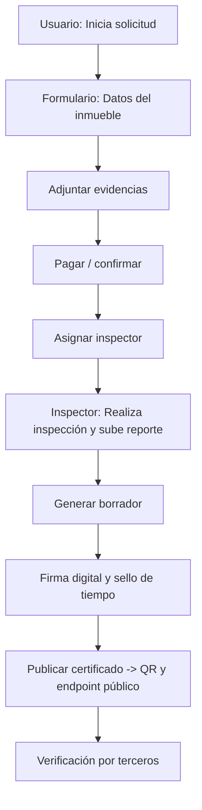
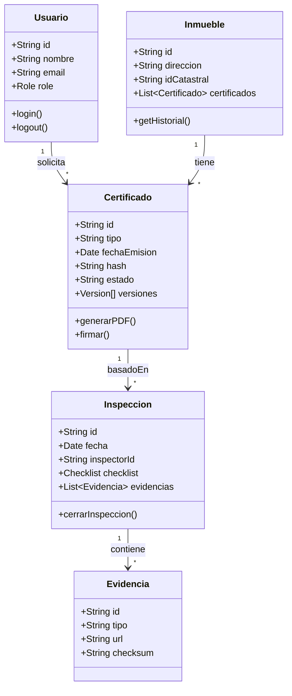
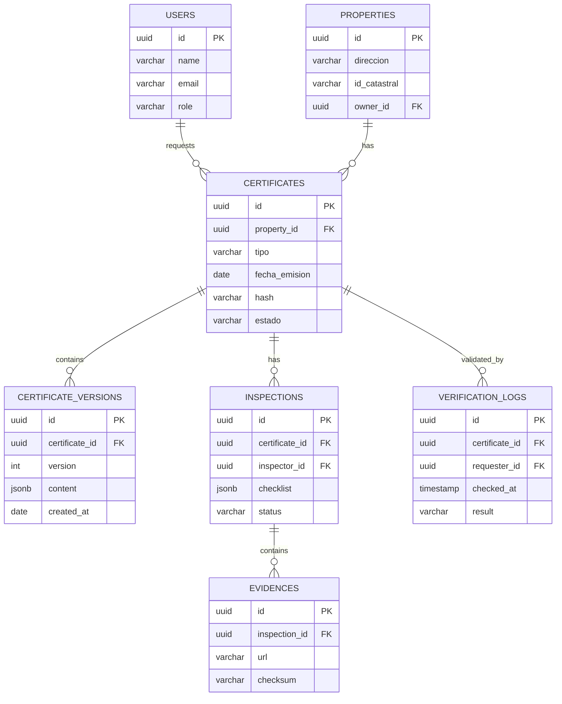

# **COURSE PROJECT**

<p align="center">
  
</p>

<p align="center"><strong>Universidad Peruana de Ciencias Aplicadas</strong></p>

<p align="center"><strong>Ingeniería de Software</strong><br>
Desarrollo de Aplicaciones Open Source<br>
<strong>Profesor:</strong> Oscar Ivan Villafuerte Bazan</p>

<h2 align="center">INFORME</h2>

<h3 align="center">Startup:</h3>
<p align="center"><strong>CertiInmueble</strong></p>

<h3 align="center">Team Members:</h3>

<div align="center">

| **Member**                           | **Code**     |
|--------------------------------------|--------------|
|Joaquin Enrique Carranza Tesén |u20191b935 |
|Miguel Ángel Junior Román López |u202212897 |
|Jhordi Luis Carranza Pérez |u20191e835|
|Juan Manuel Santos Torres |u20221a371 |

</div>

<p align="center"><strong>Abril 2025</strong></p>

# Registro de Versiones del Informe

| Versión | Fecha       | Autor(es)| Descripción de la modificación   |
|---------|-------------|--------------|----------------------|
|TB1     | 12/09/25  |Joaquin Enrique Carranza Tesén  | Creacion de la organización y repositorios en GitHub para el desarrollo conjuto del proyecto.|               |
|TB1     | 15/09/23  |Jhordi Luis Carranza Pérez  |Desarrollo del Lean UX Hypothesis Statements, Lean UX Canvas, Segmentos objetivos, Source Code Style Guide and Conventions, Software Deployment Configuration, Landing Page, Services and Applications Implementation |               |
|TB1     | 13/09/25 |Miguel Ángel Román | Desarrollo de la Startup, perfiles de integrantes de equipo, ubiquitous Language, Diseño de entrevistas,registro de entrevistas, plantilla para los User Stories |               |
|TB1     | 15/09/25  |Franco Mauricio López Román  | Desarrollo de antecendentes, UX Process, entrevistas y evidencias de ejecución de la LP|               |
|TB1     | 14/09/25 |Juan Manuel Santos Torres | Desarollo de los Needfinding, User Personas, User Task Matrix, Empathy Mapping, Big picture event storming |


# Contenido
- [Registro de Versiones del Informe](#registro-de-versiones-del-informe)
- [Project Report Collaboration Insights](#project-report-collaboration-insights)
- [Student Outcome](#student-outcome)

## Capítulo I: Introducción
- [1.1 Start-up Profile](#11-start-up-profile)
  - [1.1.1. Descripción de la Startup](#111-descripción-de-la-startup)
  - [1.1.2. Perfiles de integrantes del equipo](#112-perfiles-de-integrantes-del-equipo)
- [1.2. Solution Profile](#12-solution-profile)
  - [1.2.1 Antecedentes y problemática](#121-antecedentes-y-problemática)
  - [1.2.2 Lean UX Process](#122-lean-ux-process)
    - [1.2.2.1. Lean UX Problem Statements](#1221-lean-ux-problem-statements)
    - [1.2.2.2. Lean UX Assumptions](#1222-lean-ux-assumptions)
    - [1.2.2.3. Lean UX Hypothesis Statements](#1223-lean-ux-hypothesis-statements)
    - [1.2.2.4. Lean UX Canvas](#1224-lean-ux-canvas)
- [1.3. Segmentos objetivo](#13-segmentos-objetivo)

## Capítulo II: Requirements Elicitation & Analysis
- [2.1. Competidores](#21-competidores)
  - [2.1.1. Análisis competitivo](#211-análisis-competitivo)
  - [2.1.2. Estrategias y tácticas frente a competidores](#212-estrategias-y-tácticas-frente-a-competidores)
- [2.2. Entrevistas](#22-entrevistas)
  - [2.2.1. Diseño de entrevistas](#221-diseño-de-entrevistas)
  - [2.2.2. Registro de entrevistas](#222-registro-de-entrevistas)
  - [2.2.3. Análisis de entrevistas](#223-análisis-de-entrevistas)
  - [2.3. Needfinding](#23-needfinding)
  - [2.3.1. User Personas](#231-user-personas)
  - [2.3.2. User Task Matrix](#232-user-task-matrix)
  - [2.3.4. Empathy Mapping](#234-empathy-mapping)
  - [2.3.5. As-is Scenario Mapping](#235-as-is-scenario-mapping)
- [2.4. Ubiquitous Language](#24-ubiquitous-language)

## Capítulo III: Requirements Specification
- [3.1. To-Be Scenario Mapping](#31-to-be-scenario-mapping)
- [3.2. User Stories](#32-user-stories)
- [3.3. Impact Mapping](#33-impact-mapping)
- [3.4. Product Backlog](#34-product-backlog)

## Capítulo IV: Product Design
- [4.1. Style Guidelines](#41-style-guidelines)
  - [4.1.1. General Style Guidelines](#411-general-style-guidelines)
  - [4.1.2. Web Style Guidelines](#412-web-style-guidelines)
- [4.2. Information Architecture](#42-information-architecture)
  - [4.2.1. Organization Systems](#421-organization-systems)
  - [4.2.2. Labeling Systems](#422-labeling-systems)
  - [4.2.3. SEO Tags and Meta Tags](#423-seo-tags-and-meta-tags)
  - [4.2.4. Searching Systems](#424-searching-systems)
  - [4.2.5. Navigation Systems](#425-navigation-systems)
- [4.3. Landing Page UI Design](#43-landing-page-ui-design)
  - [4.3.1. Landing Page Wireframe](#431-landing-page-wireframe)
  - [4.3.2. Landing Page Mock-up](#432-landing-page-mock-up)
- [4.4. Web Applications UX/UI Design](#44-web-applications-uxui-design)
  - [4.4.1. Web Applications Wireframes](#441-web-applications-wireframes)
  - [4.4.2. Web Applications Wireflow Diagrams](#442-web-applications-wireflow-diagrams)
  - [4.4.2. Web Applications Mock-ups](#442-web-applications-mock-ups)
  - [4.4.3. Web Applications User Flow Diagrams](#443-web-applications-user-flow-diagrams)
- [4.5. Web Applications Prototyping](#45-web-applications-prototyping)
- [4.6. Domain-Driven Software Architecture](#46-domain-driven-software-architecture)
  - [4.6.1. Software Architecture Context Diagram](#461-software-architecture-context-diagram)
  - [4.6.2. Software Architecture Container Diagrams](#462-software-architecture-container-diagrams)
  - [4.6.3. Software Architecture Components Diagrams](#463-software-architecture-components-diagrams)
- [4.7. Software Object-Oriented Design](#47-software-object-oriented-design)
  - [4.7.1. Class Diagrams](#471-class-diagrams)
  - [4.7.2. Class Dictionary](#472-class-dictionary)
- [4.8. Database Design](#48-database-design)
  - [4.8.1. Database Diagram](#481-database-diagram)
### [Capítulo V: Product Implementation, Validation & Deployment](#capítulo-v-product-implementation-validation--deployment-1)

- [5.1. Software Configuration Management](#51-software-configuration-management)
  - [5.1.1. Software Development Environment Configuration](#511-software-development-environment-configuration)
  - [5.1.2. Source Code Management](#512-source-code-management)
  - [5.1.3. Source Code Style Guide & Conventions](#513-source-code-style-guide--conventions)
  - [5.1.4. Software Deployment Configuration](#514-software-deployment-configuration)
- [5.2. Landing Page, Services & Applications Implementation](#52-landing-page-services--applications-implementation)
  - [5.2.1. Sprint 1](#521-sprint-1)
    - [5.2.1.1. Sprint Planning 1](#5211-sprint-planning-1)
    - [5.2.1.2. Aspect Leaders and Collaborators.](#5212-aspect-leaders-and-collaborators)
    - [5.2.1.3. Sprint Backlog 1](#5213-sprint-backlog-1)
    - [5.2.1.4. Development Evidence for Sprint Review](#5214-development-evidence-for-sprint-review)
    - [5.2.1.5. Execution Evidence for Sprint Review](#5215-execution-evidence-for-sprint-review)
    - [5.2.1.6. Services Documentation Evidence for Sprint Review](#5216-services-documentation-evidence-for-sprint-review)
    - [5.2.1.7. Software Deployment Evidence for Sprint Review](#5217-software-deployment-evidence-for-sprint-review)
    - [5.2.1.8. Team Collaboration Insights during Sprint](#5218-team-collaboration-insights-during-sprint)
- [5.3. Validation Interviews](#53-validation-interviews)
  - [5.3.1. Diseño de entrevistas](#531-diseño-de-entrevistas)
  - [5.3.2. Registro de entrevistas](#532-registro-de-entrevistas)
  - [5.3.3. Evaluaciones según heurísticas](#533-evaluaciones-según-heurísticas)
- [5.4. Video About-The-Product](#54-video-about-the-product)

### [Conclusiones](#conclusiones-1)

- [Conclusiones y recomendaciones](#conclusiones-y-recomendaciones)

### [Bibliografía](#bibliografía-1)

### [Anexos](#anexos-1)

<br><br>
# Student Outcome

_ABET – EAC - Student Outcome 5_

**Criterio:**  Trabaja en equipo para cuyos miembros juntos proporcionan liderazgo, crea un etorno colaborativo e inclusivo, establece metas, planifica tareas y cumple objetivos.


En el siguiente cuadro se describe las acciones realizadas y enunciados de
conclusiones por parte del grupo, que permiten sustentar el haber alcanzado el logro
del ABET – EAC - Student Outcome 5.

| Criterio especifico                                                          | Acciones Realizadas                                                                                                                                                                                                                                                                                                                                                                                                                                                             | Conclusiones |
| :--------------------------------------------------------------------------- | :------------------------------------------------------------------------------------------------------------------------------------------------------------------------------------------------------------------------------------------------------------------------------------------------------------------------------------------------------------------------------------------------------------------------------------------------------------------------------ | ----------- |
| 1. Trabaja en equipo para proporcionar liderazgo en forma conjunta. | **Joaquin Enrique Carranza Tesen** <br> TB1: Trabajé en equipo proporcionando liderazgo conjunto. Para ello, creé la organización en GitHub, lo que permitió centralizar el proyecto y dar acceso equitativo a todos los integrantes. Además, me encargué de repartir el trabajo de manera equilibrada entre los miembros, asignando tareas específicas según las secciones del documento y las fortalezas de cada uno. Finalmente, realicé un seguimiento constante sobre el avance del documento en la plataforma, asegurándome de que todos cumplieran con sus entregas y que el proyecto mantuviera un desarrollo ordenado y colaborativo.  <br> TP1: Durante el desarrollo de la aplicación web y la landing page, trabajé en equipo asumiendo un rol de liderazgo compartido. Coordiné tareas con mis compañeros, organicé el cronograma de trabajo y aseguré que cada integrante comprendiera sus responsabilidades. Además, promoví la comunicación constante para resolver dudas y tomar decisiones en conjunto, lo que permitió que el equipo mantuviera un ritmo de trabajo equilibrado y enfocado en los objetivos del proyecto. También aporté en la mejora del informe final, integrando las observaciones del grupo y garantizando coherencia en la presentación.<br> TB2: Mi papel de liderazgo se enfoca en la calidad y la estrategia de corrección. Lidero la gestión de bugs, asegurando que las 'cosas por arreglar' se documenten, prioricen y verifiquen tras la modificación del backend. Además, ejerzo liderazgo estratégico al recomendar el desarrollo de la aplicación (modificando el backend), garantizando que el producto final sea limpio, coherente y cumpla con los estándares de la plataforma. <br> **Miguel Ángel Junior Román López** <br> TB1: Nos comunicamos en equipo para designar tareas específicas por cada intengrante para realizar el trabajo de forma más ordenanda y apoyar al integrante que tenga dificultades. Así mismo, durante el desarrollo del informe buscamos explicar de forma clara y coherente el contenido<br><br> TP1: Nos comunicamos en equipo para designar tareas específicas por cada intengrante para realizar el trabajo de forma más ordenanda y apoyar al integrante que tenga dificultades. Por  mi parte desarrollé gran parte del capituo 4 <br> **Juan Manuel Santos Torres** <br> TB1: Desarrollé los entregables clave del proyecto como el Needfinding, User Personas, User Task Matrix, Empathy Mapping, Big Picture Event Storming y la entrevista a usuarios del segmento objetivo. Estas acciones permitieron levantar información valiosa sobre las necesidades de los agentes inmobiliarios y propietarios, además de estructurar las tareas y procesos de los usuarios de manera clara. <br><br>TP1: Durante esta etapa asumí un rol activo en la definición funcional y estratégica del proyecto, elaborando las épicas, user stories y el product backlog, lo que permitió dar estructura clara y priorizada a los entregables técnicos del equipo. Estas acciones contribuyeron a que todos los integrantes comprendieran el alcance de la solución y pudieran organizar su trabajo de manera alineada. Asimismo, participé en la coordinación colaborativa de las tareas, asegurando que las decisiones se tomen en conjunto y que cada miembro tenga claridad sobre su responsabilidad. Este enfoque de liderazgo compartido permitió mantener un flujo de trabajo ordenado, participativo y enfocado en los objetivos comunes. <br><br> **Franco Mauricio López Román** <br> TB1: Asumí un rol activo dentro del equipo participando en la realización de entrevistas y en la elaboración de la problematica, antecedentes y UX Process para comprender mejor las necesidades de los usuarios. Además, realice las evidencias de ejecución de nuestra Landing Page para la apropiada documentación del proyecto.<br><br> TB2: Yo organice reuniones iniciales para definir responsabilidades, y ayude a establecer un flujo de trabajo compartido en GitHub y tome decisiones de diseño y estructura del frontend de forma consensuada.<br><br> **Jhordi Carranza** <br> TB1: Desarrollé entregables clave como el Lean UX Hypothesis Statements, Lean UX Canvas y los segmentos objetivos, que sirvieron de base para orientar el diseño de la solución. También trabajé en la guía de estilos de código y en la configuración de despliegue del software, lo cual permitió unificar criterios técnicos dentro del equipo. Finalmente, implementé la Landing Page y colaboré en la integración de servicios y aplicaciones, reforzando la parte práctica del proyecto.<br><br> **TP1:** En esta etapa me encargué del desarrollo y conexión del módulo **“Generar Certificado”** dentro del segmento de Propietario. Coordiné con los demás miembros del equipo para integrar esta sección con los servicios API y la base de datos, asegurando que los certificados se generen, validen y se relacionen correctamente con el usuario propietario. Además, revisé la navegación y la comunicación entre los módulos “Inspección” y “Certificados” para mantener la coherencia técnica y funcional del sistema.<br> TB2:Mi papel de liderazgo es puramente técnico y de ejecución. Lidero la implementación y despliegue de todas las modificaciones al backend de CertiInmuebles. Esto incluye asegurar que la arquitectura de la base de datos para la inalterabilidad funcione, que los nuevos endpoints sean seguros y que el despliegue en producción se realice de manera fluida y sin interrupciones, manteniendo la estabilidad de la plataforma  | **Joaquin Enrique Carranza Tesen**<br> TB1: La creación de la organización en GitHub, la distribución equitativa de tareas y el seguimiento constante del avance del documento permitieron un trabajo en equipo más ordenado y colaborativo. Gracias a estas acciones se fortaleció el liderazgo compartido, se garantizó la participación activa de todos los integrantes y se logró avanzar de manera eficiente hacia los objetivos planteados. <br> TP1: Demostré liderazgo colaborativo al fomentar la participación activa y la responsabilidad compartida dentro del equipo, lo que permitió alcanzar resultados de calidad en el desarrollo de la aplicación web y la landing page. <br> TB2: Garantice que las correcciones del backend no solo se hagan, sino que se hagan bien, manteniendo la documentación como la fuente única de verdad y dirigiendo las prioridades del desarrollo. <br> **Miguel Ángel Junior Román López** <br> TB1: La forma en que desarrolle los puntos del informe permite una comunicación efectiva del avance del proyecto ante distintos tipos de audiencia, desde tutores hasta usuarios. <br><br> TP1: La forma en que desarrollé el capítulo cuatro permitió al grupo tener una visión integral del desarrolo del mismo.<br> **Juan Manuel Santos Torres** <br> TB1: El desarrollo de estos puntos me permitió obtener una visión integral del problema y de las necesidades reales de los usuarios. Gracias a ello, se pudo establecer una base sólida para el diseño de la solución, alineando los hallazgos con los objetivos del proyecto y garantizando que la plataforma propuesta responda a las expectativas del mercado inmobiliario.<br><br> TP1: Fomenté un entorno colaborativo e inclusivo al trabajar junto con mis compañeros en la planificación y estructuración de los entregables clave, definiendo metas claras a través de la construcción del product backlog y las user stories. Esto permitió organizar las tareas de manera estratégica, priorizando funcionalidades y asegurando que cada integrante cuente con lineamientos precisos para su desarrollo. Además, mantuve una comunicación constante para alinear avances, resolver dudas y facilitar la integración de aportes individuales al proyecto final. Gracias a este trabajo en equipo planificado y coordinado, logramos cumplir los objetivos establecidos de forma ordenada y eficiente. <br><br> **Franco Mauricio López Román** <br> TB1: La organización del equipo permitió distribuir tareas específicas entre los integrantes, lo que facilitó un desarrollo más ordenado y eficiente del trabajo. Este enfoque colaborativo no solo optimizó el avance de cada sección, sino que también brindó apoyo a quienes enfrentaron mayores dificultades. Asimismo, el esfuerzo colectivo se orientó a lograr un informe con explicaciones claras y coherentes, garantizando la comprensión integral del contenido y reforzando la importancia del trabajo en equipo como base para alcanzar los objetivos propuestos. <br><br> **Jhordi Carranza** <br> TB1: Mi participación en los entregables conceptuales y técnicos equilibró el trabajo del equipo, integrando la visión estratégica con la parte práctica. Esto fortaleció la colaboración, permitió una mejor organización del proyecto y garantizó que el avance fuera sólido y eficiente.<br><br> **TP1:** La integración del módulo “Generar Certificado” consolidó la coordinación entre las áreas técnicas y de diseño del sistema, fortaleciendo el liderazgo compartido dentro del equipo y demostrando la capacidad de conectar los avances de software con la planificación global del proyecto.<br> TB2: Liderazgo de la Ejecución Técnica: Su liderazgo es fundamental para la operatividad. Garantiza que las correcciones recomendadas se traduzcan en un código funcional, seguro y desplegado de forma efectiva, manteniendo activa la promesa central del producto. |
| 2. Crea un entorno colaborativo e inclusivo, establece metas, planifica tareas y cumple objetivos. | **Joaquin Enrique Carranza Tesen**<br> TB1: Contribuí a crear un entorno colaborativo e inclusivo dentro del equipo. Se establecieron metas claras desde el inicio, lo que permitió orientar el trabajo de todos hacia un mismo objetivo. A partir de ello, planifiqué las tareas de manera organizada, asignándolas de forma equitativa y considerando las fortalezas de cada integrante. Gracias a esta organización, logramos cumplir los objetivos planteados dentro de los plazos establecidos y con una participación activa de todos. <br>TB2: Durante el desarrollo de la aplicación web y la landing page, me enfoqué en crear un entorno colaborativo e inclusivo donde todos los integrantes del equipo pudieran aportar ideas y participar en la toma de decisiones. Establecí metas claras y alcanzables para cada etapa del proyecto, planifiqué las tareas de manera organizada y coordiné el seguimiento del avance para asegurar que se cumplieran los objetivos en los plazos establecidos. Además, fomenté un ambiente de respeto y apoyo mutuo, lo que permitió mantener la motivación y la eficiencia del grupo.<br> TB2: Estableci las metas de calidad al limpiar la documentación y recomendar la modificación del backend. Mi tarea clave es planificar la corrección de bugs (cosas por arreglar). Esto asegura que el equipo trabaje con un enfoque claro y correcto, siendo la voz de la coherencia estratégica. <br> **Miguel Ángel Junior Román López**<br> TB1: Usando herramientas de comunicación escrita nos apoyamos mutuamente y completamos lo necesario para la TB1. Elaboré el contenido de la Startup, tabla de perfiles de integrantes de equipo, ubiquitous language y el product design.<br><br> TP1:Usando herramientas de comunicación como Whatsapp y discord nos apoyomaos mutuamente para completar lo requerido. En mi casó desarrolle varios avances del capítulo 4<br><br> **Juan Manuel Santos Torres** <br> TB1: Participé activamente en la coordinación del equipo, fomentando un entorno colaborativo e inclusivo donde cada integrante pudiera aportar sus ideas. Contribuí en la planificación de tareas y metas, asegurando que los entregables se desarrollen en los plazos establecidos y apoyando a mis compañeros cuando surgieron dificultades.<br><br> TP1: La definición y priorización de épicas, historias de usuario y product backlog consolidó un liderazgo compartido y organizado, brindando una hoja de ruta común, claridad de responsabilidades y dependencia entre tareas. Esto alineó al equipo en torno a objetivos medibles, redujo ambigüedades y mejoró la coordinación en las decisiones, favoreciendo la entrega a tiempo y con coherencia técnica y funcional. <br><br> **Franco Mauricio López Román**<br> TB1: Fomenté un ambiente de trabajo inclusivo y colaborativo. Al establecer metas claras y planificando tareas como la realización de entrevistas para obtener información clave de los usuarios, la realización de las entrevista para guiar el dasarrollo del proyecto y sus debidas evidencias.<br><br> **Jhordi Carranza**<br> TB1: Contribuí en la creación de un entorno colaborativo al coordinar la integración de la Landing Page y la implementación de servicios y aplicaciones, tomando en cuenta los aportes de todos los miembros. También documenté la guía de estilos de código y la configuración de despliegue, lo que permitió organizar el trabajo técnico y cumplir con los plazos establecidos.<br><br> **TP1:** Durante esta etapa reforcé la colaboración técnica dentro del equipo mediante la integración funcional entre los módulos del sistema, en especial la conexión entre **Propietario – Inspección – Certificados**. Participé en la revisión y ajuste del flujo de generación y validación de certificados, asegurando que las metas técnicas y de diseño se cumplan en conjunto. Además, apoyé en la resolución de errores de importación y en la estandarización de la estructura de carpetas del proyecto para mejorar la colaboración.<br> TB2: Planifique y ejecuto todas las tareas de código y cumplo el objetivo de desplegar el backend modificado de forma segura. Mi meta es asegurar que el sistema que maneja la inalterabilidad de los documentos funcione perfectamente en producción, haciendo viable la visión de la documentación. | **Joaquin Enrique Carranza Tesen**<br> TB1: El desarrollo de un entorno colaborativo e inclusivo, junto con la definición de metas claras y la planificación ordenada de tareas, permitió que el equipo trabajara de manera eficiente. Esto fortaleció la comunicación, favoreció la integración de cada miembro y garantizó el cumplimiento exitoso de los objetivos propuestos. <br>TP1:La creación de un entorno colaborativo e inclusivo, junto con una planificación adecuada, fue fundamental para cumplir con los objetivos del proyecto y garantizar que el desarrollo de la aplicación web y la landing page se realizara de forma ordenada y efectiva. <br> TB2: Mi objetivo es que la plataforma CertiInmuebles cumpla su promesa de transparencia porque las especificaciones son precisas y las tareas están ordenadas. <br> **Miguel Ángel Junior Román López**<br> TB1: El trabajo en equipo permitió presentar la información técnica de manera clara, estructurada y coherente, contribuyendo al desarrollo de competencias comunicativas conforme al Student Outcome 5.  <br><br>El TP1: El trabajo en equipo permitió presentar esta entrega de forma estructurada y coherente, contribuyendo al desarrollo de competencias comunicativas conforme al Student Outcome 5<br><br> **Juan Manuel Santos Torres** <br> TB1: La organización y el trabajo en equipo permitieron cumplir con los objetivos planteados en el proyecto, logrando avances sostenidos en cada iteración. Mantener un entorno inclusivo y colaborativo fortaleció la comunicación y generó confianza entre los miembros, lo que se reflejó en un mejor desempeño colectivo. <br><br>TP1: Al estructurar el backlog con metas iterativas y criterios de aceptación, y sostener una comunicación continua para integrar aportes y destrabar bloqueos, se fortaleció un entorno colaborativo e inclusivo. La planificación basada en valor y la visibilidad del avance facilitaron el cumplimiento de plazos, elevaron la calidad y consistencia de los entregables y dejaron un proceso reproducible para siguientes iteraciones. <br><br> **Franco Mauricio López Román** <br> TB1: La experiencia demostró que fomentar un ambiente inclusivo y colaborativo, acompañado de la definición de metas claras, permite potenciar el trabajo en equipo y orientar los esfuerzos hacia un objetivo común. <br><br> **Jhordi Carranza** <br> TB1: Mi trabajo en la documentación técnica y la integración práctica permitió cumplir los objetivos en los tiempos previstos. Además, se fortaleció la organización del equipo y se consolidó un entorno inclusivo en el que cada aporte se conectó con el objetivo común.<br><br> **TP1:** La integración del flujo de generación y validación de certificados entre módulos permitió consolidar un entorno de trabajo colaborativo entre áreas técnicas y de interfaz. Esto mejoró la calidad del producto final y demostró la capacidad del equipo para coordinar entregables complejos cumpliendo las metas planificadas. <br> TB2: Mi objetivo es hacer que el sistema funcione de manera estable y segura en la realidad, garantizando que el usuario pueda confiar en el núcleo técnico de CertiInmuebles.  |


# Capítulo I: Introducción
## 1.1. Startup Profile
### 1.1.1 Descripción de la Startup
CertiInmueble es una startup innovadora fundada por estudiantes de Ingeniería de Software de la UPC, orientada a transformar el mercado inmobiliario mediante la emisión de certificados digitales verificables sobre el estado de inmuebles. Nuestra misión es proporcionar transparencia, seguridad y confianza en transacciones inmobiliarias mediante una plataforma web que integra información técnica, legal y estructural en documentos digitales inalterables.  

El equipo de CertiInmueble opera bajo un modelo de trabajo colaborativo y ágil, donde cada miembro contribuye, fomentando un entorno inclusivo y de mejora continua. La cultura de equipo se basa en la comunicación abierta, la toma de decisiones consensuadas y el compromiso con los objetivos comunes, asegurando que todas las voces sean escuchadas y valoradas. <br>

### 1.1.2 Perfiles de Integrantes de equipo
| Integrantes | Descripción |
|-------------|-------------|
| **Román López, Miguel Ángel Junior - U202212897** | Mi nombre es Miguel Angel Junior Román López y estoy llevando el curso de Aplicaciones Web de la carrera de Ingeniería de Software. Poseo habilidades como la comunicación, responsabilidad y organización que ayudarán al equipo a trabajar mejor cada avance requerido del proyecto. Por todo ello, mi compromiso será trabajar en equipo y entregar las actividades que se requieran puntualmente. |
| **Carranza Tesén, Joaquin Enrique - U20191B935** | Hola, soy Joaquín Carranza. Tengo 24 años y actualmente curso el sexto ciclo de la carrera de Ingeniería de Software. Me gusta la tecnología y la forma en que ayuda a las personas a resolver problemas de manera más rápida y eficiente. Me interesa especialmente el manejo de datos y la ciberseguridad. Siento que puedo aportar a mi equipo ideas desde otra perspectiva, ya que siempre me cuestiono cómo se podría mejorar el producto o hacia qué objetivo estamos apuntando. |
| **Santos Torres, Juan Manuel - U20221A371** |  Mi nombre es Juan Manuel Santos, Tengo 21 años y actualmente curso el séptimo ciclo de la carrera de Ingeniería de Software. Me apasiona el desarrollo web y la inteligencia artificial, ya que considero que ambas áreas son clave para crear soluciones innovadoras y de gran impacto. Cuento con habilidades de comunicación y liderazgo que me permiten coordinar al equipo y mantener un ambiente de colaboración efectivo. Siento que puedo aportar al proyecto una visión orientada a la innovación tecnológica, proponiendo ideas que combinen la IA con herramientas prácticas para resolver problemas del mercado inmobiliario. Me motiva trabajar en proyectos como CertiInmueble porque representan un reto real donde puedo aplicar mis conocimientos y aprender a diseñar productos que generen confianza y transparencia en la sociedad. |
| **López Román, Franco Mauricio - U202315890** | Me llamo Franco Mauricio Lopez, tengo 21 años y soy estudiante de la carrera de Ingenieria de Software. Me considero una persona responsable y comprometida, que da su mayor esfuerzo para el proyecto, con una comunicación para el trabajo en equipo, me apasiona la programación y los videojuegos. Durante este proyecto me comprometo a aportar todo mi conocimiento y habilidad para el beneficio del grupo. |
| **Carranza Pérez, Jhordi Luis - U20191e835** | Hola, soy Jhordi Carranza, estudiante del sexto ciclo de Ingeniería de Software. Tengo conocimientos en desarrollo web (HTML, CSS, JavaScript) y en lenguajes de programación como C++, C#, Python y Java. Me gusta ser responsable y hacer las cosas bien, comprometiéndome siempre con las metas del equipo. Considero que puedo aportar al proyecto tanto en la parte técnica como en la organización, manteniendo un trabajo ordenado y de calidad. |


## 1.2. Solution Profile
### 1.2.1 Antecedentes y problemática
**What (Qué):**<br>
El mercado inmobiliario requiere la verificación del estado legal, técnico y estructural de los inmuebles mediante certificados emitidos por distintas entidades.<br>
**Where (Dónde):**<br>
En países como Perú y otros mercados emergentes, este proceso se realiza de forma fragmentada, con trámites en SUNARP, municipalidades, notarías, laboratorios de inspección técnica y otras instituciones.<br>
**When (Cuándo):**<br>
El problema se hace evidente en el momento de realizar transacciones inmobiliarias (compra, venta, alquiler, hipotecas o auditorías), donde la información debe estar disponible en plazos cortos y de manera confiable.<br>
**Who (Quiénes):**<br>
Compradores, vendedores, arrendadores, arrendatarios, entidades financieras, notarías, autoridades regulatorias y corredores inmobiliarios.<br>
**Why (Por qué):**<br>
Porque actualmente los certificados se gestionan de manera manual, presencial y no estandarizada, generando retrasos, costos innecesarios y desconfianza en las partes involucradas.<br>
**How (Cómo):**<br>
Mediante un proceso que combina trámites en distintas entidades, solicitudes presenciales y la entrega de documentos físicos, muchas veces sin mecanismos de verificación digital.<br>
**How much (Cuánto):**<br>
Los tiempos de espera pueden superar los 15 a 30 días hábiles, con costos asociados que van desde cientos hasta miles de soles en gestiones, sin contar los riesgos derivados de fraudes o información inconsistente.

### 1.2.2 Lean UX Process
#### 1.2.2.1. Lean UX Problem Statements
**Quiénes son los usuarios**<br>
Los principales usuarios de esta plataforma son compradores y vendedores de inmuebles, arrendadores y arrendatarios, instituciones financieras, empresas de corretaje inmobiliario y entidades regulatorias. Todos ellos participan en distintos procesos relacionados con la compraventa, alquiler, financiamiento o supervisión de bienes inmuebles y, por lo tanto, requieren información confiable, actualizada y verificable sobre el estado legal, técnico y estructural de las propiedades.<br>
**Qué necesitan**<br>
Estos usuarios necesitan un mecanismo unificado y confiable que les permita obtener certificados digitales de estado de inmuebles, que integren de forma clara información proveniente de registros públicos, municipalidades, inspecciones técnicas y otros actores relevantes. Además, requieren que dichos documentos estén disponibles de manera rápida, accesible y verificable en línea, con mecanismos que garanticen su autenticidad, integridad y vigencia.<br>
**Por qué lo necesitan**<br>
Actualmente, el proceso de verificación de información de un inmueble está compuesto por una serie de trámites manuales, presenciales y fragmentados, realizados en diferentes instituciones, lo que genera demoras, altos costos y riesgo de errores o inconsistencias. A esto se suma la existencia de fraudes documentales frecuentes en el mercado inmobiliario, como falsificación de certificados o manipulación de informes técnicos, lo que afecta la confianza de las partes involucradas y eleva la probabilidad de conflictos legales. En un contexto donde la transparencia es clave para la toma de decisiones, los usuarios requieren una solución que elimine estas barreras.<br>
**Cómo la solución satisface la necesidad**<br>
La plataforma propuesta ofrecerá un sistema web que centraliza la generación, gestión y emisión de certificados digitales sobre el estado de los inmuebles. Estos certificados estarán protegidos mediante firmas electrónicas, trazabilidad digital y mecanismos de validación en línea, lo que asegurará que no puedan ser manipulados ni falsificados. La solución permitirá que tanto compradores como vendedores, arrendadores, instituciones financieras y autoridades accedan a un documento seguro, estandarizado y verificable en tiempo real, lo que aumentará la transparencia, reducirá costos operativos y mejorará la eficiencia en las transacciones inmobiliarias.

#### 1.2.2.2. Lean UX Assumptions
 **Sobre los usuarios y sus necesidades**<br>
1. Los usuarios (compradores, vendedores, arrendadores y entidades financieras) otorgan un alto valor a la confiabilidad y transparencia en la información relacionada con los inmuebles, ya que una transacción inmobiliaria representa una inversión significativa y conlleva riesgos legales y económicos.

2. Los usuarios están frustrados por los procesos manuales actuales, que requieren tiempo, esfuerzo y desplazamientos a diferentes entidades, y estarían dispuestos a migrar hacia una solución digital que agilice y simplifique estas gestiones.

3. Tanto compradores como arrendadores buscan reducir riesgos legales, financieros y de seguridad estructural en sus operaciones, y consideran que un certificado digital validado en línea puede ser un elemento diferenciador clave para decidir concretar una transacción.

 **Sobre la solución propuesta**<br>
1. La existencia de una plataforma centralizada que permita emitir certificados digitales estandarizados será percibida como más confiable y segura que los documentos físicos dispersos emitidos por diferentes entidades.

2. La incorporación de firmas electrónicas, sellos de tiempo y mecanismos de trazabilidad digital generará confianza en la validez legal y técnica de los certificados, disminuyendo la percepción de riesgo entre los usuarios.

3. Si el sistema ofrece validación en línea en tiempo real, tanto compradores como instituciones financieras lo utilizarán como parte natural del proceso de evaluación de inmuebles, lo que incrementará la adopción de la plataforma.

**Sobre el impacto esperado**<br>
1. Se asume que la digitalización del proceso reducirá en al menos un 50% el tiempo promedio de obtención de certificados de estado de inmuebles en comparación con el proceso manual actual, lo que generará un ahorro significativo en costos y recursos.

2. La implementación de un sistema seguro de emisión reducirá la incidencia de fraudes y manipulaciones documentales, fortaleciendo la confianza en el mercado inmobiliario y disminuyendo la probabilidad de conflictos legales.

3. Se espera que la solución digital contribuya a mejorar la transparencia, competitividad y eficiencia en las operaciones del sector inmobiliario, incentivando un mayor dinamismo en el mercado y facilitando la toma de decisiones más rápidas y seguras por parte de las partes interesadas.

#### 1.2.2.3. Lean UX Hypothesis Statements

- **Hipótesis 1: Confianza en transacciones**  
  Creemos que al ofrecer certificados digitales sobre el estado de inmuebles a compradores o arrendatarios  
  Para personas interesadas en adquirir o alquilar propiedades en zonas urbanas  
  Se logrará mayor confianza y seguridad en sus decisiones de compra o alquiler.  
  Sabremos que tendremos éxito cuando al menos un cierto porcentaje de los usuarios reportan que el certificado fue determinante en su decisión.

- **Hipótesis 2: Reducción de fraudes**  
  Creemos que al establecer la información ya sea técnica, legal y estructural de un inmueble en un certificado verificado  
  Para arrendatarios y compradores  
  Se logrará una disminución de casos de fraude inmobiliario y conflictos legales.  
  Sabremos que tendremos éxito cuando se registre una reducción en los reclamos que estén relacionados a la información falsa o incompleta.

- **Hipótesis 3: Eficiencia de trámites**  
  Creemos que al digitalizar la emisión de certificados de estado de inmuebles  
  Para instituciones tales como las notarías, municipalidades y bancos  
  Se logrará una reducción considerable en tiempos de gestión y costos de administración.  
  Sabremos que tendremos éxito cuando el tiempo promedio de verificación documental disminuya.

- **Hipótesis 4: Aceptación institucional**  
  Creemos que al garantizar la autenticidad de los certificados mediante registros y firmas digitales  
  Para entidades financieras y notariales  
  Se logrará la adopción de los certificados como documentos válidos en procesos de crédito hipotecario y formalización de contratos.  
  Sabremos que tendremos éxito cuando las instituciones adopten oficialmente el uso de certificados en el primer año.

- **Hipótesis 5: Experiencia del usuario**  
  Creemos que al diseñar una plataforma web simple y accesible para generar y gestionar certificados  
  Para usuarios sin conocimientos técnicos avanzados  
  Se logrará una mayor satisfacción y recurrencia en el uso de la plataforma.  
  Sabremos que tendremos éxito cuando el índice de satisfacción del usuario sea considerablemente alto.


#### 1.2.2.4. Lean UX Canvas
<p align="center">
  
</p>


## 1.3. Segmentos Objetivos

A continuación se describen los dos segmentos objetivos principales para CertiInmueble, incluyendo características demográficas relevantes y datos estadísticos de respaldo:

### Segmento Objetivo 1: Propietarios de inmuebles

**Características demográficas:**

- Personas adultas entre **35 y 60 años**, dueños de uno o más inmuebles.  
- Nivel socioeconómico medio-alto a alto, con capacidad para invertir en mantenimiento o certificaciones de su inmueble.  
- Localizados principalmente en zonas urbanas de Lima u otras grandes ciudades del Perú, con interés en formalización legal del inmueble.  
- Sexo indistinto, aunque estudios muestran que en compras de vivienda, los hombres y mujeres participan, pero en decisiones de propiedad suelen estar involucradas parejas o familias.  

**Información estadística de sustento:**

- En un estudio “Perfil del comprador inmobiliario 2024”, los Millennials (28-40 años aproximadamente) representan el **50% de los compradores** de viviendas en Perú, seguidos por la Generación X con ~33 % del mercado. ([pqs.pe](https://pqs.pe/actualidad/perfil-del-comprador-inmobiliario-2024-el-83-del-mercado-esta-concentrado-en-millennials-y-generacion-x/?utm_source=chatgpt.com))  
- De las compras residenciales, ~63 % se destinan a vivienda principal; de este grupo, ~38 % de compradores migran de ser arrendatarios a propietarios. ([pqs.pe](https://pqs.pe/actualidad/perfil-del-comprador-inmobiliario-2024-el-83-del-mercado-esta-concentrado-en-millennials-y-generacion-x/?utm_source=chatgpt.com))  

### Segmento Objetivo 2: Agentes inmobiliarios y profesionales intermediarios

**Características demográficas:**

- Profesionales dedicados a la intermediación de compra, venta o alquiler de inmuebles (agentes inmobiliarios, corredores).  
- Edad entre **30 y 55 años**, con experiencia en el mercado local, buen dominio de procesos legales básicos, al menos nivel educativo técnico o superior.  
- Operan en zonas urbanas y suelen trabajar con varios clientes simultáneamente, gestionando documentación, visitas, contratos y trámites legales.  
- Interés en agilizar trámites, reducir riesgos legales, garantizar la transparencia con sus clientes para mejorar su reputación y oferta de valor.

**Información estadística de sustento:**

- En el mismo estudio “Perfil del comprador inmobiliario 2024”, se reporta que una parte significativa de los compradores residenciales están dejando de arrendar para adquirir propiedades, lo que implica demanda liderada por quienes ya conocen procesos inmobiliarios o para quienes intermediarios tienen presencia. ([pqs.pe](https://pqs.pe/actualidad/perfil-del-comprador-inmobiliario-2024-el-83-del-mercado-esta-concentrado-en-millennials-y-generacion-x/?utm_source=chatgpt.com))  
- El mercado inmobiliario en Lima muestra que los precios por m² varían mucho según distrito, lo cual motiva a profesionales inmobiliarios a querer certificados fiables para sustentar valoraciones y negociaciones. Datos del Banco Central de Reserva del Perú muestran series de precios por m² en distritos en Lima (Barranco, Miraflores, La Molina, etc.).  

# Capítulo II: Requirements Elicitation & Analysis

## 2.2 Entrevistas

Para poder valorar mejor la propuesta solución planteada a esta problemática, se diseñaron preguntas claves respecto a la propuesta de solución y a la situación de los usuarios con la problemática que poseen. Se buscará que diferentes personas con características cercanas a los segmentos objetivos puedan responderlas. De esta manera, se podrán obtener mejores respuestas cercanas a lo que se necesita para conocer los requerimientos o necesidades que los usuarios necesitan satisfacer. Luego, se registrarán las respuestas dadas por los entrevistados y se realizará un análisis de cada respuesta dada para identificar las necesidades de los usuarios.

## 2.1 Competidores

### 2.1.1 Análisis Competitivo
<table>
  <tr>
    <td colspan="7" align="center"><strong>Competitive Analysis Landscape</strong></td>
  </tr>
  <tr>
    <td align="center"><strong>¿Por qué llevar a cabo este análisis?</strong></td>
    <td colspan="6" align="center">
      Es importante al desarrollar una página web porque permite conocer qué hacen los competidores, sus fortalezas y debilidades. Esto ayuda a identificar oportunidades, evitar errores ya cometidos y diferenciar la propuesta. En resumen, brinda una visión clara del mercado y facilita crear una página web más atractiva y útil para los usuarios.
    </td>
  </tr>
  <tr>
    <td colspan="2"></td>
    <td align="center">CertiInmueble<br> </td>
    <td align="center">VeriCasa<br> </td>
    <td align="center">GLEM Estudios y Proyectos<br> </td>
    <td align="center">TECNITASA<br> </td>
    <td align="center">Veliz y Asociados<br> </td>
  </tr>
  <tr>
    <td rowspan="2" align="center"><strong>Perfil</strong></td>
    <td align="center"><strong>Overview</strong></td>
    <td align="center">Plataforma digital que centraliza la certificación del estado de inmuebles, con reportes claros, trazables y verificables en línea.</td>
    <td align="center">Inspección de viviendas para verificar acabados, instalaciones y dimensiones antes de entrega o arrendamiento.</td>
    <td align="center">Firma de ingeniería que realiza evaluaciones estructurales, patología de fallas y reforzamientos.</td>
    <td align="center">Multinacional que ofrece tasación de bienes inmuebles, valorizaciones y supervisión de obras.</td>
    <td align="center">Estudio que integra arquitectura, ingeniería y derecho para saneamiento físico-legal de propiedades.</td>
  </tr>
  <tr>
    <td align="center"><strong>Ventaja Competitiva</strong></td>
    <td align="center">Certificados digitales rápidos y transparentes, integrando aspectos técnicos, legales y fotográficos en una sola plataforma, accesible en cualquier momento.</td>
    <td align="center">Reportes sencillos, orientados a compradores e inquilinos; útil en la recepción de viviendas.</td>
    <td align="center">Alta especialización técnica en estructuras, capaz de diagnosticar problemas complejos.</td>
    <td align="center">Reconocimiento y confianza ante bancos e instituciones financieras; credibilidad formal.</td>
    <td align="center">Solución integral legal-técnica, agiliza la regularización de predios.</td>
  </tr>
  <tr>
    <td rowspan="2" align="center"><strong>Perfil del Marketing</strong></td>
    <td align="center"><strong>Mercado Objetivo</strong></td>
    <td align="center">Compradores, vendedores, inmobiliarias y notarios que requieren un certificado confiable y rápido</td>
    <td align="center">Compradores e inquilinos de viviendas nuevas o usadas.</td>
    <td align="center">Empresas constructoras, inmobiliarias y dueños de inmuebles con problemas estructurales.</td>
    <td align="center">Bancos, financieras, aseguradoras y constructoras.</td>
    <td align="center">Propietarios que buscan regularizar predios, municipalidades, inmobiliarias.</td>
  </tr>
  <tr>
    <td align="center"><strong>Estrategias de Marketing</strong></td>
    <td align="center">Marketing digital (redes, Google Ads), convenios con notarías y portales inmobiliarios, campañas B2C y B2B.</td>
    <td align="center">Campañas digitales en redes, alianzas con inmobiliarias y constructoras.</td>
    <td align="center">Participación en licitaciones, networking en colegios de ingenieros.</td>
    <td align="center">Alianzas con bancos y entidades financieras, marketing corporativo.</td>
    <td align="center">Charlas legales, convenios con municipalidades y gremios inmobiliarios.</td>
  </tr>
  <tr>
    <td rowspan="3" align="center"><strong>Perfil del Producto</strong></td>
    <td align="center"><strong>Productos & Servicios</strong></td>
    <td align="center">Certificados digitales verificables con fotos, checklist técnico-legal y firma electrónica.</td>
    <td align="center">Inspección física de viviendas, checklist de acabados e instalaciones.</td>
    <td align="center">Evaluaciones estructurales, reforzamientos, patología de fallas.</td>
    <td align="center">Tasaciones de inmuebles, valorizaciones, supervisión de obras.</td>
    <td align="center">Saneamiento físico-legal, regularización de propiedades, expedientes técnicos.</td>
  </tr>
  <tr>
    <td align="center"><strong>Precios & Costos</strong></td>
    <td align="center">Modelo freemium: certificado básico gratuito + planes premium (con validación avanzada, integración con notarios).</td>
    <td align="center">Pago por inspección (precio accesible para clientes individuales).</td>
    <td align="center">Costos elevados según alcance (diagnósticos y reforzamientos).</td>
    <td align="center">Tarifas variables, orientadas a empresas e instituciones financieras.</td>
    <td align="center">Honorarios por servicios legales/técnicos, costo según complejidad.</td>
  </tr>
  <tr>
    <td align="center"><strong>Canales Web y Móvil</strong></td>
    <td align="center">App móvil (iOS/Android) + plataforma web con historial digital y acceso en línea a certificados.</td>
    <td align="center">Página web y reservas online, informes entregados en PDF.</td>
    <td align="center">Web corporativa, atención presencial y por encargo.</td>
    <td align="center">Web institucional, servicios presenciales, informes digitales.</td>
    <td align="center">Web y atención presencial, coordinación con municipalidades.</td>
  </tr>
  <tr>
    <td rowspan="4" align="center"><strong>SWOT</strong></td>
    <td align="center"><strong>Fortalezas</strong></td>
    <td align="center">Digital, rápida, con trazabilidad y acceso en línea.</td>
    <td align="center">Especialización en inspecciones prácticas y fáciles de entender.</td>
    <td align="center">Alta especialización en estructuras complejas.</td>
    <td align="center">Reconocimiento oficial y credibilidad ante bancos.</td>
    <td align="center">Cobertura integral legal + técnica.</td>
  </tr>
  <tr>
    <td align="center"><strong>Oportunidades</strong></td>
    <td align="center">Crecimiento de la digitalización inmobiliaria y demanda de confianza en compraventa.</td>
    <td align="center">Crecimiento del mercado de alquileres y compras de vivienda.</td>
    <td align="center">Demanda de diagnósticos post-sismo o en edificaciones antiguas.</td>
    <td align="center">Expansión con fintech e hipotecas digitales.</td>
    <td align="center">Demanda de formalización y saneamiento en Perú.</td>
  </tr>
  <tr>
    <td align="center"><strong>Debilidades</strong></td>
    <td align="center">Empresa nueva sin reputación inicial.</td>
    <td align="center">No cubre aspectos legales ni estructurales.</td>
    <td align="center">Alto costo, limitado a proyectos grandes.</td>
    <td align="center">Servicios orientados más a empresas que a individuos.</td>
    <td align="center">Procesos largos y presenciales, poca digitalización.</td>
  </tr>
  <tr>
    <td align="center"><strong>Amenazas</strong></td>
    <td align="center">Regulaciones legales o barreras de entrada para validación oficial.</td>
    <td align="center">Competencia de startups digitales similares.</td>
    <td align="center">Nuevas tecnologías de monitoreo estructural más accesibles.</td>
    <td align="center">Entrada de competidores internacionales digitales.</td>
    <td align="center">Avances en plataformas legales online que simplifiquen trámites.</td>
  </tr>
</table>

### 2.1.2 Estrategias y tácticas frente a competidores
- **Certificado verificable:** La empresa incorpora firma digital y un código QR para asegurar que el documento sea auténtico y fácil de validar.
- **Plataforma web sencilla:** Se desarrolla un portal accesible desde computadora o celular, donde se puedan generar y consultar certificados.
- **Inspecciones híbridas básicas:** Se combinan visitas presenciales con la posibilidad de enviar fotos o videos para agilizar la verificación del inmueble.
- **Modelo de negocio claro:** Se ofrece un pago por certificado emitido y descuentos para clientes frecuentes como inmobiliarias o agentes.
- **Marketing digital inicial:** Se aprovechan redes sociales y alianzas con páginas de clasificados inmobiliarios para darse a conocer y captar usuarios.

## 2.2 Entrevistas
### 2.2.1 Diseño de entrevistas

**Segmento objetivo 1: Propietarios de inmuebles**

Preguntas:
- ¿Qué aspectos consideras más importantes al evaluar el estado de un inmueble?
- ¿Has tenido problemas con documentación falsa o alterada al realizar transacciones inmobiliarias?
- ¿Qué tan familiarizado estás con los certificados digitales y su validez legal?
- ¿Qué información consideras indispensable en un certificado de estado de inmueble?
- ¿Cómo te gustaría recibir y compartir estos certificados?
- ¿Estarías dispuesto a pagar por un servicio que certifique digitalmente el estado de tu inmueble?
- ¿Qué preocupaciones tendrías sobre la seguridad de tus datos en una plataforma de este tipo?

**Segmento objetivo 2: Agentes inmobiliarios**

Preguntas:
- ¿Qué documentación requieres actualmente para evaluar un inmueble?
- ¿Cómo verificas la autenticidad de los documentos proporcionados por los propietarios?
- ¿Qué ventajas ves en tener certificados digitales verificables?
- ¿Qué información adicional te gustaría incluir en un certificado de inmueble?
- ¿Cómo integrarías este servicio en tu flujo de trabajo actual?
- ¿Qué funcionalidades consideras esenciales en una plataforma de certificación?
- ¿Qué tan dispuesto estarías a recomendar este servicio a tus clientes?

### 2.2.2 Registro de entrevistas

**Entrevista 1 - Propietario**

| Campo          | Detalle                |
|----------------|------------------------|
| ENTREVISTADOR  | Franco López |
| ENTREVISTADO   | Salomé Román |
| Fecha          | 15/08/25 |
| Edad           | 44 |
| Duración       | 5:55 |
| Profesión      | Coordinadora municipal |
| Enlace         | [[URL de la entrevista]](https://upcedupe-my.sharepoint.com/:v:/g/personal/u202315890_upc_edu_pe/ESwVn88TtPJCji3vOk0EDJMBnqlhVKoU5PafwLrjtZJbrA?e=Rw7rZb&nav=eyJyZWZlcnJhbEluZm8iOnsicmVmZXJyYWxBcHAiOiJTdHJlYW1XZWJBcHAiLCJyZWZlcnJhbFZpZXciOiJTaGFyZURpYWxvZy1MaW5rIiwicmVmZXJyYWxBcHBQbGF0Zm9ybSI6IldlYiIsInJlZmVycmFsTW9kZSI6InZpZXcifX0%3D) |
| Segmento       | Propietario            |
| Resumen        | Salome Román, una trabajadora de 44, coordinadora de la municipalidad de Miraflores. Compartió su opinión y experiencia acerca de los estados y verificación de los inmuebles que llego a adquirir a lo largo de los años, explicando su conocomiento sobre los certificados virtuales y su opinión sobre su validez. Ella reconoció no saber mucho del tema degital, pero expreso la importancia que le da a los servicios de agua y electricos además de la sana infraestructura de un inmueble a la hora de evaluar un certificado de su calidad. Finalmente, mostró un amplio interes en nuestro proyecto y sus funcionalidades principales |

**Entrevista 2 - Propietario**

| Campo          | Detalle                |
|----------------|------------------------|
| ENTREVISTADOR  | Franco López |
| ENTREVISTADO   | Victor Hugo López |
| Fecha          | 16/08/25 |
| Edad           | 58 |
| Duración       | 3:35 |
| Profesión      | Medico - Jefe de unidad UCI |
| Enlace         | [[URL de la entrevista]](https://upcedupe-my.sharepoint.com/:v:/g/personal/u202315890_upc_edu_pe/EeBRFqF1Ne9KnfQWXi-F8dwBhADRXqhxcFwerT5Heb5KwA?e=o8Te2a&nav=eyJyZWZlcnJhbEluZm8iOnsicmVmZXJyYWxBcHAiOiJTdHJlYW1XZWJBcHAiLCJyZWZlcnJhbFZpZXciOiJTaGFyZURpYWxvZy1MaW5rIiwicmVmZXJyYWxBcHBQbGF0Zm9ybSI6IldlYiIsInJlZmVycmFsTW9kZSI6InZpZXcifX0%3D) |
| Segmento       | Propietario            |
| Resumen        |El entrevistado Victor López, un medico jefe de una unidad UCI, considera que al evaluar el estado de un inmueble, los aspectos más relevantes son la condición estructural, la situación legal y la veracidad de la documentación presentada. Reconoce que en el mercado inmobiliario existen riesgos asociados a documentación falsa o alterada, lo que genera desconfianza y demora en las transacciones. En cuanto a los certificados digitales, manifiesta un nivel bajo a medio de familiaridad, aunque percibe que su validez legal y confiabilidad serán factores clave para generar confianza en su uso. Respecto al contenido, considera indispensable incluir información estructural, legal, de servicios básicos y cargas registrales del inmueble. En general, muestra interés en soluciones digitales que brinden confianza, seguridad y respaldo legal, siempre que se asegure la protección de la información y se simplifique el proceso de compraventa.|

**Entrevista 3 - Propietario**

| Campo          | Detalle                |
|----------------|------------------------|
| ENTREVISTADOR  | Joaquín Carranza |
| ENTREVISTADO   | Juan Gutierrez |
| Fecha          | 21/09/25 |
| Edad           | 29 |
| Duración       | 3:26 |
| Profesión      | Arrendero de inmuebles |
| Enlace         | [[URL de la entrevista]](https://upcedupe-my.sharepoint.com/:v:/g/personal/u20191b935_upc_edu_pe/EaF9w8_-wPBDtzfD-b3XyHsBUi835RCvyPh0GEs8m8Mqow?nav=eyJyZWZlcnJhbEluZm8iOnsicmVmZXJyYWxBcHAiOiJTdHJlYW1XZWJBcHAiLCJyZWZlcnJhbFZpZXciOiJTaGFyZURpYWxvZy1MaW5rIiwicmVmZXJyYWxBcHBQbGF0Zm9ybSI6IldlYiIsInJlZmVycmFsTW9kZSI6InZpZXcifX0%3D&e=qv2WE1) |
| Segmento       | Propietario            |
| Resumen        |El entrevistado considera que lo más importante al evaluar un inmueble es la seguridad legal (que no tenga cargas ni deudas) y el estado físico. Aunque no ha tenido problemas directos con documentación falsa, conoce casos que generan desconfianza. Reconoce la existencia y validez de los certificados digitales, pero aún confía más en documentos físicos. Para él, un certificado debe incluir información sobre hipotecas, embargos, deudas y la titularidad real. Prefiere recibirlos en formato digital, fácil de descargar y compartir. Estaría dispuesto a pagar por este servicio si el costo es razonable y garantiza seguridad. Su mayor preocupación es la protección de sus datos y el riesgo de accesos no autorizados o fraudes.|

**Entrevista 4 - Agente Inmobiliario**

| Campo          | Detalle                |
|----------------|------------------------|
| ENTREVISTADOR  | Franco López |
| ENTREVISTADO   | Daniel Castro  |
| Fecha          | 17/09/25 |
| Edad           | 40 |
| Duración       | 12:34 |
| Experiencia    | Venta de terrenos |
| Enlace         | [[URL de la entrevista]](https://upcedupe-my.sharepoint.com/:v:/g/personal/u202315890_upc_edu_pe/EfkmPoXMRadKh5Zq5jjEPe0BasTOQkwv3-Cq-oR0eG5MuA?e=rwOLx1&nav=eyJyZWZlcnJhbEluZm8iOnsicmVmZXJyYWxBcHAiOiJTdHJlYW1XZWJBcHAiLCJyZWZlcnJhbFZpZXciOiJTaGFyZURpYWxvZy1MaW5rIiwicmVmZXJyYWxBcHBQbGF0Zm9ybSI6IldlYiIsInJlZmVycmFsTW9kZSI6InZpZXcifX0%3D) |
| Segmento       | Agente Inmobiliario    |
| Resumen        | El señor Daniel Castro señala que para evaluar un inmueble actualmente requiere títulos de propiedad, partidas registrales, documentos de cargas y gravámenes, licencias municipales, planos y constancias de servicios básicos. El proceso de verificación suele implicar consultas manuales en Registros Públicos y validaciones adicionales con municipalidades o notarías, lo que resulta lento y propenso a errores..Percibe claras ventajas en contar con certificados digitales verificables, principalmente en términos de rapidez, reducción de trámites presenciales, disminución de riesgos de fraude documental y mayor confianza en las transacciones. Considera que un certificado de inmueble debería incluir, además de la información estructural y legal básica, detalles técnicos de mantenimiento, historial de remodelaciones y reportes de tasación actualizados. En su flujo de trabajo, integraría el servicio como un requisito previo a la publicación de propiedades y antes de concretar negociaciones, lo que le permitiría ofrecer a sus clientes mayor seguridad y transparencia.|

**Entrevista 5 - Agente Inmobiliario**

| Campo          | Detalle                |
|----------------|------------------------|
| ENTREVISTADOR  | Juan Manuel Santos |
| ENTREVISTADO   | Jorge Torres |
| Fecha          | 20/09/25 |
| Edad           | 26 |
| Duración       | 3:48 |
| Profesión      | Compraventa de inmuebles residenciales y comerciales |
| Enlace         | [[URL de la entrevista]](https://youtu.be/f1AL52Cvnes) |
| Segmento       | Agente Inmobiliario             |
| Resumen        | Jorge Andrés Santos es un joven de 26 años dedicado a la compraventa de inmuebles residenciales y comerciales. Actualmente requiere documentos como la partida registral de SUNARP, constancia de no adeudo, planos y tasaciones, aunque reconoce que verificarlos es un proceso lento y vulnerable a fraudes. Considera que los certificados digitales verificables serían una gran ventaja porque ahorrarían tiempo, reducirían riesgos y generarían confianza con sus clientes. Le gustaría que incluyan información legal, técnica, estructural y fotográfica. Integraría este servicio antes de publicar inmuebles y en reuniones con notarios o bancos. Para él, la plataforma debe ser fácil de usar, con validación en tiempo real, descarga en PDF e historial de certificados, y afirma que la recomendaría siempre que tenga validez legal.                       |

**Entrevista 6 - Agente Inmobiliario**

| Campo          | Detalle                |
|----------------|------------------------|
| ENTREVISTADOR  | Joaquín Carranza |
| ENTREVISTADO   | Emily Auqui |
| Fecha          | 20/09/25 |
| Edad           | 26 |
| Duración       | 5:23 |
| Profesión      | Compraventa de inmuebles residenciales y comerciales |
| Enlace         | [[URL de la entrevista]](https://upcedupe-my.sharepoint.com/:v:/g/personal/u20191b935_upc_edu_pe/EfTDeDl8SXpPq1pTHT-WL0UB5ZJGyD6szjAq_C-ovY1y5A?nav=eyJyZWZlcnJhbEluZm8iOnsicmVmZXJyYWxBcHAiOiJTdHJlYW1XZWJBcHAiLCJyZWZlcnJhbFZpZXciOiJTaGFyZURpYWxvZy1MaW5rIiwicmVmZXJyYWxBcHBQbGF0Zm9ybSI6IldlYiIsInJlZmVycmFsTW9kZSI6InZpZXcifX0%3D&e=MkDz9z) |
| Segmento       | Agente Inmobiliario             |
| Resumen        | La entrevistada solicita actualmente partida registral, HR y PU, planos, copia literal, recibos de servicios y, en propiedades nuevas, licencia y conformidad de obra. Verifica autenticidad principalmente en SUNARP y municipalidades, además de contrastar con visitas físicas. Ve en los certificados digitales una ventaja en ahorro de tiempo y reducción de fraudes. Considera importante que incluyan historial de propietarios, cargas, zonificación, valor referencial y estado de pagos municipales. Integraría este servicio en la captación y negociación de inmuebles para asegurar transparencia. Piensa que la plataforma debe ser fácil de usar, con validación oficial, descargas rápidas, alertas de vencimiento, historial y alta seguridad. Estaría muy dispuesto a recomendarla a clientes, ya que aumentaría la confianza en su gestión como agente.                      |

### 2.2.3 Análisis de entrevistas

---

## 2.3. Needfinding

### 2.3.1. User Personas
**Segmento 1: Propietarios de inmuebles**


**Segmento objetivo 2: Agentes inmobiliarios**


### 2.3.2. User Task Matrix

| **Propietario de Inmueble** | **Frequency / Importance** | **Agente Inmobiliario** | **Frequency / Importance** |
|------------------------------|----------------------------|--------------------------|-----------------------------|
| Solicitar certificados digitales del inmueble | High / High | Verificar autenticidad de documentos de propiedad | High / High |
| Revisar estado técnico y legal del inmueble | High / High | Gestionar documentación de múltiples propiedades | High / High |
| Validar certificados para procesos de venta o alquiler | High / High | Brindar confianza a clientes mostrando certificados verificables | High / High |
| Dar seguimiento al historial de mantenimiento | Medium / High | Coordinar con notarios y bancos para trámites | High / High |
| Compartir certificados con compradores o arrendatarios | Medium / High | Reducir tiempos en trámites documentarios | Medium / High |
| Controlar costos y tiempos de certificación | Medium / Medium | Acceder a certificados desde cualquier dispositivo | Medium / High |


### 2.3.3. User Journey Mapping
**A continuación se mostrarán los User Journey Mapping de los segmentos objetivos.**

**Segmento 1: Propietarios de inmuebles**


**Segmento objetivo 2: Agentes inmobiliarios**


### 2.3.4. Empathy Mapping
**A continuación se mostrarán los Empathy Mapping de los segmentos objetivos.**

**Segmento 1: Propietarios de inmuebles**


**Segmento objetivo 2: Agentes inmobiliarios**


## 2.4 Big Picture Event Storming

### **Actores**
- Propietario  
- Comprador/Arrendatario  
- Agente/Corredor  
- Verificador Técnico  
- Notaría/Banco  
- Plataforma CertiHome  
- Integraciones (SUNARP, Municipios, Firma/TS, Pasarela de pago)  

### **Eventos de Dominio** (en pasado, orden aproximado)
1. **Solicitud de certificación creada**  
2. **Datos del inmueble recopilados**  
3. **Titularidad verificada**  
4. **Inspección técnica registrada**  
5. **Hallazgos técnicos consolidados**  
6. **Información municipal consultada**  
7. **Observaciones legales detectadas** (opcional)  
8. **Borrador de certificado generado**  
9. **Certificado firmado digitalmente**  
10. **Certificado publicado**  
11. **Certificado validado por terceros**  
12. **Actualización del certificado solicitada**  
13. **Certificado revocado** (si aplica)  

### **Comandos**
- Crear solicitud  
- Registrar inspección  
- Cargar evidencias  
- Consolidar hallazgos  
- Generar borrador  
- Firmar certificado  
- Publicar certificado  
- Validar certificado  
- Solicitar actualización  
- Revocar certificado  

### **Políticas**
- Si **inspección registrada** y faltan evidencias → *solicitar evidencia adicional*.  
- Si **observaciones legales detectadas** → *marcar “con observaciones”* y *notificar*.  
- Si **certificado publicado** → *habilitar QR/endpoint de validación* y *auditar accesos*.  
- Si **actualización solicitada** → *invalidar versión anterior* y *generar nueva versión*.  

### **Agregados / Entidades**
- **Certificado** (estado, versión, hash, firma, QR)  
- **Inmueble** (id catastral/SUNARP, dirección, características)  
- **Solicitud** (solicitante, alcance, pago/orden)  
- **Inspección** (checklist, fotos, videos, responsable)  
- **Verificación Legal** (partidas, cargas, licencias)  

### **Bounded Contexts (tentativos)**
- Onboarding & Solicitudes  
- Verificación Legal  
- Inspección Técnica  
- Emisión & Firma  
- Publicación & Validación  
- Gestión de Versiones  

### **Integraciones**
- SUNARP  
- Municipios/Tributos  
- Pasarela de Firma y Sellado de Tiempo  
- Almacenamiento de evidencias  
- API/QR de validación pública  
- Pasarela de pago  

### **Hotspots**
- Fuentes externas no confiables  
- Cadena de custodia de evidencias  
- Reglas de versión/revocación  
- Validez normativa de firmas/TS  

### **Métricas**
- SLA tiempo-a-certificado  
- % certificados con observaciones  
- Tasa de validaciones externas  
- Retrabajo por evidencias faltantes  
- Uptime del endpoint de validación  

## 2.5 Ubiquitous Language

El lenguaje ubicuo fue desarrollado en dos sesiones de Event Storming con participación de todos los miembros del equipo. Definimos los siguientes términos clave:

- **Certificado Digital**: Documento electrónico que certifica el estado de un inmueble, con validez legal y verificación digital.  
- **Inmueble**: Propiedad raíz que puede ser certificada (casa, departamento, local comercial, terreno).  
- **Estado Técnico**: Evaluación de las condiciones físicas y estructurales del inmueble.  
- **Verificación**: Proceso de validación de autenticidad del certificado mediante claves digitales.  
- **Sello Digital**: Elemento de seguridad que garantiza la inalterabilidad del certificado.  
- **Historial de Mantenimiento**: Registro cronológico de reparaciones y mejoras realizadas al inmueble.  

Este glosario fue consensuado por todo el equipo y está disponible en el Wiki de nuestro repositorio GitHub para referencia constante durante el desarrollo.  

# Capítulo III: Requirements Specification
## 3.1. To-Be Scenario Mapping

* **Segmento 1: Propietarios de inmuebles**

| **Fases**                           | **Publicación y Gestión de Inmuebles**                                                                                   | **Certificación de la Propiedad**                                                                                                 | **Autenticación y Gestión de Usuario**                                                                                         |
|-------------------------------------|------------------------------------------------------------------------------------------------------------------------|-------------------------------------------------------------------------------------------------------------------------|------------------------------------------------------------------------------------------------------------------------------|
| **Doing**                           | El propietario registra su inmueble en la plataforma, sube documentos legales y técnicos (planos, escritura, etc.).                 | Envía los documentos a la entidad verificadora y recibe un certificado digital firmado electrónicamente.  | Se registra en la plataforma, valida su identidad y crea un perfil con la información de sus propiedades.  |
| **Thinking**                         | ¿La información que estoy subiendo es suficiente y clara para que el inmueble sea certificado más rápido?                                      | ¿La certificación aumentará la confianza en mi propiedad y acelerará la venta?                             | ¿La plataforma asegura que mis datos personales y documentos estarán protegidos?                     |
| **Feeling**                          | Se siente responsable al documentar adecuadamente su propiedad.         | Se siente satisfecho y optimista al obtener el certificado digital que da valor a su inmueble.                      | Se siente tranquilo y confiado al ver que sus datos están protegidos con procesos seguros.            |

* **Segmento 2: Agentes inmobiliarios**

| **Fases**                           | **Consulta de Certificados**                                                                                   | **Presentación de Propiedades**                                                                                                 | **Autenticación y Gestión de Usuario**                                                                                         |
|-------------------------------------|------------------------------------------------------------------------------------------------------------------------|-------------------------------------------------------------------------------------------------------------------------|------------------------------------------------------------------------------------------------------------------------------|
| **Doing**                           | El agente busca inmuebles dentro de la plataforma y accede a los certificados digitales verificados.              | Comparte los certificados con clientes mediante enlaces seguros o documentos descargables.      | Se registra en la plataforma como agente autorizado y gestiona su portafolio de propiedades certificadas.  |
| **Thinking**                         | ¿Este inmueble cuenta con un certificado válido y actualizado que aumente la confianza del comprador?   | ¿Cómo puedo aprovechar esta certificación para cerrar la venta más rápido y con menos objeciones?                                               | ¿La plataforma valida de manera clara mi rol como agente inmobiliario?                              |
| **Feeling**                          | Se siente respaldado al acceder a información transparente y verificada. | Se siente motivado y confiado al mostrar propiedades certificadas a sus clientes.                           | Se siente reconocido como actor clave en la plataforma y seguro de que sus datos están bien gestionados.                      |

## 3.2 User Stories

Épicas:

| Epic ID | Título                                      | Descripción                                                                                                                                          |
| ------- | ------------------------------------------- | ---------------------------------------------------------------------------------------------------------------------------------------------------- |
| EP01    | Emisión de certificados verificables        | Como comprador de un inmueble, quiero acceder a certificados digitales verificables para tener seguridad sobre el estado legal, técnico y estructural de la propiedad. |
| EP02    | Gestión de información de inmuebles         | Como vendedor de un inmueble, quiero subir la información técnica y legal de mi propiedad en la plataforma para agilizar el proceso de certificación. |
| EP03    | Validación en talleres y entidades          | Como entidad verificadora, quiero validar la información de los inmuebles en la plataforma para garantizar la autenticidad y credibilidad de los certificados. |
| EP04    | Transparencia en las transacciones          | Como agente inmobiliario, quiero mostrar certificados digitales a mis clientes para generar confianza y cerrar transacciones con mayor rapidez. |
| EP05    | Reportes y trazabilidad                     | Como administrador de la plataforma, quiero generar reportes sobre la emisión y uso de certificados para garantizar la trazabilidad y transparencia del proceso. |
| EP06    | Notificaciones y alertas                    | Como usuario de la plataforma, quiero recibir notificaciones automáticas sobre el estado de los certificados y documentos para mantenerme informado. |
| EP07    | Autenticación segura                        | Como usuario, quiero iniciar sesión y validar mi identidad de forma segura para proteger mi información. |
| EP08    | Gestión de cuentas de usuario               | Como administrador, quiero gestionar cuentas y permisos para controlar el acceso y roles dentro de la plataforma. |
| EP09    | Historial de acciones y auditoría           | Como administrador, quiero visualizar el historial de acciones realizadas para garantizar trazabilidad y seguridad. |
| EP10    | OCR y validación automática de documentos   | Como vendedor, quiero que la plataforma reconozca automáticamente los datos de los documentos para agilizar el proceso de certificación. |
| EP11    | Recordatorios automáticos                   | Como comprador y vendedor, quiero recibir recordatorios sobre fechas importantes para no perder plazos en el proceso de certificación. |
| EP12    | Panel de control                            | Como administrador, quiero contar con un panel visual con métricas e indicadores clave para tomar mejores decisiones. |
| EP13    | Filtros y búsqueda avanzada                 | Como usuario, quiero filtrar certificados e inmuebles por múltiples criterios para encontrar información fácilmente. |
| EP14    | Reenvío y duplicado de certificados         | Como agente inmobiliario, quiero reenviar o duplicar certificados válidos para agilizar transacciones similares. |
| EP15    | Módulo de soporte y feedback                | Como usuario, quiero dejar consultas o reportar problemas para recibir asistencia rápidamente. |
| EP16    | Validación multi-entidad                    | Como entidad verificadora, quiero validar información en conjunto con otras entidades para reforzar la credibilidad del certificado. |
| EP17    | Firma digital multi-actor                   | Como entidad verificadora, quiero que varios actores puedan firmar un certificado digital para dar mayor respaldo legal. |
| EP18    | Almacenamiento en la nube                   | Como administrador, quiero almacenar documentos y certificados en la nube para mejorar el acceso y la seguridad de la información. |
| EP19    | Generación de estadísticas automáticas      | Como administrador, quiero que el sistema genere estadísticas sobre procesos, tiempos y certificados para optimizar la gestión. |
| EP20    | Exportación y compatibilidad de datos       | Como usuario, quiero exportar certificados e información en formatos estándar (PDF, Excel, CSV) para utilizarlos fuera de la plataforma. |


Historias de Usuario:

| ID   | Épica | User Story                              | Historia                                                                                                                                                        | Criterios de Aceptación                                                                                                                                                                                                                                                                         |
| ---- | ----- | --------------------------------------- | --------------------------------------------------------------------------------------------------------------------------------------------------------------- | ----------------------------------------------------------------------------------------------------------------------------------------------------------------------------------------------------------------------------------------------------------------------------------------------- |
| US01 | EP01  | Solicitar certificado de inmueble       | Como comprador, quiero solicitar un certificado digital del inmueble para validar su estado legal, técnico y estructural.                                        | Escenario 1: Dado que un comprador solicita el certificado, cuando el sistema valida la solicitud, entonces genera un certificado digital.<br> Escenario 2: Dado que faltan documentos, cuando el comprador solicita el certificado, entonces el sistema muestra un error indicando los requisitos incompletos. |
| US02 | EP01  | Descargar certificado digital           | Como comprador, quiero descargar el certificado en formato PDF para almacenarlo y consultarlo en cualquier momento.                                             | Escenario 1: Dado que un certificado está validado, cuando el comprador descarga el archivo, entonces recibe un PDF con sello digital.<br> Escenario 2: Dado que el certificado aún no está aprobado, cuando intenta descargarlo, entonces el sistema bloquea la acción. |
| US03 | EP02  | Subir documentos legales                | Como vendedor, quiero subir documentos legales de mi propiedad para iniciar el proceso de certificación.                                                        | Escenario 1: Dado que el vendedor adjunta documentos válidos, cuando hace clic en "subir", entonces el sistema los almacena correctamente.<br> Escenario 2: Dado que el documento está en formato no permitido, cuando intenta subirlo, entonces el sistema muestra un mensaje de error. |
| US04 | EP02  | Editar información técnica              | Como vendedor, quiero actualizar la información técnica de mi inmueble para asegurar que el certificado sea preciso.                                            | Escenario 1: Dado que el vendedor modifica datos, cuando guarda los cambios, entonces el sistema actualiza la información.<br> Escenario 2: Dado que los cambios no cumplen el formato requerido, cuando guarda, entonces el sistema muestra un error. |
| US05 | EP03  | Validar documentos subidos              | Como entidad verificadora, quiero revisar los documentos cargados para confirmar su autenticidad.                                                              | Escenario 1: Dado que el verificador recibe documentos, cuando los valida, entonces el sistema cambia el estado a “verificado”.<br> Escenario 2: Dado que los documentos no son válidos, cuando los revisa, entonces el sistema cambia el estado a “rechazado”. |
| US06 | EP03  | Firmar digitalmente certificado         | Como entidad verificadora, quiero firmar digitalmente el certificado para garantizar su validez legal.                                                          | Escenario 1: Dado que el certificado está aprobado, cuando el verificador firma, entonces se añade la firma digital.<br> Escenario 2: Dado que el certificado tiene inconsistencias, cuando intenta firmar, entonces el sistema bloquea la acción. |
| US07 | EP04  | Consultar certificados públicos         | Como agente inmobiliario, quiero consultar los certificados digitales de los inmuebles disponibles para mostrar a mis clientes.                                | Escenario 1: Dado que un inmueble tiene certificado, cuando el agente consulta, entonces el sistema muestra el documento.<br> Escenario 2: Dado que el inmueble no tiene certificado, cuando consulta, entonces el sistema informa “certificado no disponible”. |
| US08 | EP04  | Compartir certificado con cliente       | Como agente inmobiliario, quiero compartir el certificado digital con mis clientes para generar confianza en la transacción.                                   | Escenario 1: Dado que el agente selecciona un certificado, cuando hace clic en compartir, entonces el sistema envía el enlace seguro.<br> Escenario 2: Dado que el certificado está expirado, cuando intenta compartirlo, entonces el sistema muestra un error. |
| US09 | EP05  | Generar reporte de certificados emitidos| Como administrador, quiero generar reportes de certificados emitidos para llevar control de las operaciones.                                                   | Escenario 1: Dado que el administrador solicita un reporte, cuando selecciona un rango de fechas, entonces el sistema genera el informe.<br> Escenario 2: Dado que no hay datos en el rango, cuando solicita el reporte, entonces el sistema devuelve “sin resultados”. |
| US10 | EP05  | Consultar historial de verificaciones   | Como administrador, quiero consultar el historial de validaciones para asegurar la trazabilidad del proceso.                                                   | Escenario 1: Dado que existen registros, cuando el administrador consulta, entonces el sistema muestra la lista de verificaciones.<br> Escenario 2: Dado que no hay registros, cuando consulta, entonces el sistema devuelve un historial vacío. |
| US11 | EP01  | Verificar validez de certificado        | Como comprador, quiero verificar en línea la validez de un certificado para confirmar que no ha sido alterado.                                                 | Escenario 1: Dado que el comprador ingresa un código de certificado, cuando lo valida, entonces el sistema confirma la autenticidad.<br> Escenario 2: Dado que el código es inválido, cuando lo ingresa, entonces el sistema muestra “certificado no encontrado”. |
| US12 | EP04  | Filtrar inmuebles con certificado       | Como agente inmobiliario, quiero filtrar inmuebles que ya cuenten con certificado para priorizar opciones seguras.                                            | Escenario 1: Dado que selecciona el filtro, cuando consulta inmuebles, entonces el sistema muestra solo los que tienen certificado.<br> Escenario 2: Dado que ningún inmueble cumple con el filtro, cuando aplica el criterio, entonces el sistema muestra “sin resultados”. |
| US13 | EP06  | Recibir notificaciones de estado        | Como usuario, quiero recibir notificaciones cuando cambia el estado de mi certificado para mantenerme informado.                                               | Escenario 1: Dado que el certificado cambia de estado, cuando ocurre el cambio, entonces el sistema envía una notificación.<br> Escenario 2: Dado que las notificaciones están desactivadas, no se envía nada. |
| US14 | EP06  | Configurar alertas personalizadas       | Como usuario, quiero configurar qué alertas recibir para no saturarme de notificaciones innecesarias.                                                          | Escenario 1: Dado que el usuario personaliza alertas, cuando se cumple la condición configurada, entonces recibe la notificación correspondiente. |
| US15 | EP07  | Iniciar sesión segura                   | Como usuario, quiero iniciar sesión con autenticación segura para proteger mi información.                                                                     | Escenario 1: Dado que el usuario ingresa credenciales válidas, accede a la plataforma.<br> Escenario 2: Si las credenciales no son válidas, se muestra un mensaje de error. |
| US16 | EP07  | Recuperar contraseña                    | Como usuario, quiero recuperar mi contraseña mediante correo electrónico para no perder acceso a mi cuenta.                                                   | Escenario 1: Dado que solicita recuperación, cuando ingresa su correo, entonces recibe un enlace para restablecerla. |
| US17 | EP08  | Crear y asignar roles                   | Como administrador, quiero crear y asignar roles a los usuarios para controlar sus accesos.                                                                    | Escenario 1: Dado que se crea un nuevo rol, cuando se asigna a un usuario, entonces este obtiene permisos definidos. |
| US18 | EP09  | Consultar historial de acciones         | Como administrador, quiero ver todas las acciones realizadas en la plataforma para mantener un registro auditable.                                             | Escenario 1: Dado que el admin abre el historial, cuando filtra por fecha, entonces se muestran las acciones registradas. |
| US19 | EP10  | Escanear documentos con OCR             | Como vendedor, quiero que el sistema extraiga automáticamente datos de mis documentos para ahorrar tiempo.                                                     | Escenario 1: Dado que subo un documento válido, cuando se procesa, entonces el sistema extrae los datos correctamente.<br> Escenario 2: Si el documento no es legible, muestra un mensaje de error. |
| US20 | EP11  | Recibir recordatorios de vencimiento    | Como comprador, quiero recibir recordatorios antes de que expire un certificado para poder renovarlo a tiempo.                                                | Escenario 1: Dado que el certificado está por expirar, cuando falta un periodo definido, entonces el sistema envía un recordatorio. |
| US21 | EP12  | Ver indicadores clave en dashboard      | Como administrador, quiero ver métricas como certificados emitidos y tiempo promedio de aprobación para gestionar mejor la plataforma.                        | Escenario 1: Dado que el admin accede al panel, cuando carga los datos, entonces se muestran indicadores actualizados. |
| US22 | EP13  | Buscar por múltiples filtros            | Como usuario, quiero aplicar filtros combinados para encontrar certificados e inmuebles específicos.                                                           | Escenario 1: Dado que selecciono filtros, cuando aplico búsqueda, entonces obtengo resultados precisos.<br> Escenario 2: Si no hay coincidencias, se muestra “sin resultados”. |
| US23 | EP14  | Reenviar certificado existente          | Como agente inmobiliario, quiero reenviar certificados válidos para acelerar futuras transacciones.                                                            | Escenario 1: Dado que selecciona un certificado válido, cuando hace clic en reenviar, entonces el sistema genera un nuevo enlace compartible. |
| US24 | EP15  | Enviar consulta al soporte              | Como usuario, quiero enviar un ticket de soporte para resolver dudas o problemas.                                                                             | Escenario 1: Dado que envío una consulta, cuando se registra correctamente, entonces recibo un número de seguimiento. |
| US25 | EP16  | Validación coordinada entre entidades   | Como entidad verificadora, quiero validar en conjunto con otras entidades para garantizar mayor credibilidad.                                                 | Escenario 1: Dado que la validación es conjunta, cuando todas aprueban, entonces el estado cambia a “validado múltiple”. |
| US26 | EP17  | Firma digital conjunta                  | Como entidad verificadora, quiero que varios actores puedan firmar digitalmente un certificado para reforzar su validez legal.                                | Escenario 1: Dado que varios firmantes firman el documento, cuando todas las firmas se completan, entonces el certificado se marca como validado legalmente. |
| US27 | EP18  | Subida automática a la nube             | Como administrador, quiero que los documentos y certificados se almacenen automáticamente en la nube para asegurar disponibilidad.                             | Escenario 1: Dado que se genera un certificado, cuando se aprueba, entonces se sube automáticamente a la nube. |
| US28 | EP19  | Generar estadísticas automáticas        | Como administrador, quiero que el sistema genere reportes automáticos semanales con estadísticas clave.                                                        | Escenario 1: Dado que el periodo se cumple, cuando se ejecuta el proceso, entonces el sistema envía un reporte automático. |
| US29 | EP20  | Exportar información                    | Como usuario, quiero exportar certificados y datos en formatos como PDF y Excel para compartirlos o almacenarlos fuera de la plataforma.                       | Escenario 1: Dado que selecciono el formato, cuando confirmo la acción, entonces se descarga el archivo. |
| US30 | EP20  | Exportar reportes masivos               | Como administrador, quiero exportar múltiples certificados en un solo archivo para generar reportes institucionales.                                           | Escenario 1: Dado que selecciono varios registros, cuando exporto, entonces se genera un único archivo comprimido con la información. |


## 3.3. Impact Mapping

| Objetivo                                           | Actores                 | Impactos esperados                                                                 | Funcionalidades asociadas                                                                                              |
| -------------------------------------------------- | ----------------------- | ---------------------------------------------------------------------------------- | ---------------------------------------------------------------------------------------------------------------------- |
| **Generar confianza en las transacciones inmobiliarias**       | Compradores           | - Mayor seguridad al adquirir propiedades. <br> - Reducción de fraudes inmobiliarios. | - Emisión de certificados digitales verificables. <br> - Validación online de autenticidad con código único.                              |
| **Agilizar procesos de compraventa de inmuebles** | Vendedores              | - Menor tiempo en trámites previos a la venta. <br> - Mayor atractivo de la propiedad en el mercado.          | - Plataforma para subir documentos legales y técnicos. <br> - Actualización de datos del inmueble en tiempo real.                                     |
| **Garantizar la validez de la información de los inmuebles**         | Entidades verificadoras   | - Procesos de validación más transparentes. <br> - Menor riesgo de falsificación de documentos.        | - Módulo de validación documental. <br> - Firma digital de certificados.                                        |
| **Optimizar la gestión de inmuebles certificados**     | Agentes inmobiliarios | - Acceso rápido a información confiable. <br> - Aumento en la tasa de cierre de ventas.        | - Consulta de certificados en línea. <br> - Opción de compartir certificados con clientes vía enlace seguro. |
| **Garantizar trazabilidad y sostenibilidad del sistema**     | Administradores | - Mayor control de certificados emitidos. <br> - Monitoreo de uso de la plataforma.        | - Generación de reportes históricos. <br> - Exportación de métricas en PDF. <br> - Panel de trazabilidad completa. |

## 3.4. Product Backlog

| Orden | Épica | Título                                           | Relación con User Story | Prioridad | Story Points |
| ----- | ----- | ----------------------------------------------- | ----------------------- | --------- | ------------ |
| 1     | EP01  | Emisión de certificados digitales verificables  | US01                    | Alta      | 8            |
| 2     | EP01  | Descarga de certificado en PDF                  | US02                    | Alta      | 5            |
| 3     | EP01  | Verificación online de validez de certificado   | US11                    | Alta      | 5            |
| 4     | EP02  | Subida de documentos legales y técnicos         | US03                    | Alta      | 8            |
| 5     | EP02  | Edición y actualización de información técnica  | US04                    | Media     | 5            |
| 6     | EP03  | Validación de documentos                        | US05                    | Alta      | 8            |
| 7     | EP03  | Firma digital                                   | US06                    | Alta      | 5            |
| 8     | EP04  | Consulta de certificados disponibles            | US07                    | Alta      | 5            |
| 9     | EP04  | Compartir certificado con cliente               | US08                    | Media     | 3            |
| 10    | EP04  | Filtrar inmuebles con certificado               | US12                    | Media     | 3            |
| 11    | EP05  | Generar reportes de certificados                | US09                    | Media     | 5            |
| 12    | EP05  | Consultar historial de verificaciones          | US10                    | Baja      | 3            |
| 13    | EP06  | Notificaciones de estado                        | US13                    | Alta      | 5            |
| 14    | EP06  | Configuración de alertas                        | US14                    | Media     | 3            |
| 15    | EP07  | Iniciar sesión segura                           | US15                    | Alta      | 5            |
| 16    | EP07  | Recuperar contraseña                            | US16                    | Media     | 3            |
| 17    | EP08  | Gestión de roles y permisos                      | US17                    | Alta      | 5            |
| 18    | EP09  | Historial de acciones                            | US18                    | Alta      | 5            |
| 19    | EP10  | OCR para extracción de datos                      | US19                    | Alta      | 8            |
| 20    | EP11  | Recordatorios automáticos                        | US20                    | Media     | 3            |
| 21    | EP12  | Panel de control                                 | US21                    | Alta      | 8            |
| 22    | EP13  | Filtros y búsqueda avanzada                      | US22                    | Alta      | 5            |
| 23    | EP14  | Reenvío de certificados                          | US23                    | Media     | 3            |
| 24    | EP15  | Soporte y feedback                               | US24                    | Media     | 3            |
| 25    | EP16  | Validación multi-entidad                         | US25                    | Alta      | 8            |
| 26    | EP17  | Firma multi-actor                                | US26                    | Alta      | 5            |
| 27    | EP18  | Almacenamiento en la nube                         | US27                    | Alta      | 4           |
| 28    | EP19  | Estadísticas automáticas                          | US28                    | Media     | 5            |
| 29    | EP20  | Exportación de datos                              | US29                    | Alta      | 5            |
| 30    | EP20  | Exportación masiva                                | US30                    | Media     | 5            |


# Capítulo IV: Product Design

## 4.1. Style Guidelines

### 4.1.1. General Style Guidelines
**Producto:** CertiInmueble  
**Brand Promise:** Transparencia, confianza y trazabilidad en transacciones inmobiliarias mediante certificados digitales verificables.  
**Tono comunicacional:** Profesional, cercano, claro y técnico cuando aplica. Evitar jerga legal sin explicación.

**Valores visuales:**
- Confianza → colores sobrios y contrastes altos donde importe (estado legal/alertas).
- Legibilidad → tipografías sans-serif con buena legibilidad a pantalla y móvil.
- Jerarquía → uso consistente de tamaños de tipografía, cards y iconografía.
- Accesibilidad → contrast ratio ≥ 4.5:1 para texto normal; navegación por teclado y ARIA en componentes.

**Paleta sugerida (tokens):**
- Primary: `#0B4F6C` (azul profundo)
- Secondary: `#2E8B57` (verde moderado)
- Accent: `#F2A365` (naranja suave)
- Neutral 900: `#0F1724` (texto principal)
- Neutral 100: `#F7FAFC` (fondo claro)
- Danger: `#D9534F` (alertas legales / revocaciones)

**Tipografías:**
- Inter (primaria): para interfaces y títulos.
- Open Sans (secundaria): para cuerpo y documentos.
Tamaños base (desktop): H1 36px, H2 28px, H3 22px, Body 16px, Small 14px.

**Iconografía y fotografías:**
- Iconos lineales con peso medio.
- Fotografías: imágenes reales de inmuebles (alta resolución) y diagramas/tomas focalizadas (plano, fachada, grietas) con metadatos EXIF como evidencia.

**Botones y estados:**
- Primary CTA: fondo Primary + texto blanco.
- Secondary: borde Primary transparent background.
- Disabled: 30% opacity.
- Microcopy: usar verbos claros (“Verificar”, “Descargar certificado”, “Solicitar inscripción”).

---

### 4.1.2. Web Style Guidelines 
**Design tokens (ejemplos CSS variables):**
```css
:root {
  --color-primary: #0B4F6C;
  --color-secondary: #2E8B57;
  --color-accent: #F2A365;
  --color-neutral-900: #0F1724;
  --color-neutral-100: #F7FAFC;
  --radius-md: 8px;
  --shadow-sm: 0 1px 3px rgba(0,0,0,0.08);
  --font-sans: 'Inter', system-ui, -apple-system, 'Segoe UI', Roboto, 'Helvetica Neue', Arial;
}
```

**Componentes clave (atomic):**
- Header (logo + search de inmuebles por dirección/SUNARP + login).
- Hero card (buscar inmueble por ID catastral o dirección).
- Certificate card (miniatura del certificado con QR y estado).
- Evidence gallery (fotos, PDF, vídeo).
- Timeline/Historial (versiones del certificado).
- Modal de verificación (mostrar hash, firma, sello de tiempo).
- Panel administrativo (gestión de solicitudes, revisiones, revocaciones).

---

## 4.2. Information Architecture

### 4.2.1. Organization Systems
Estructura principal del sitio (top-level):
- Inicio
- Buscar inmueble
- Generar solicitud / Nuevo certificado
- Mis certificados (usuario)
- Verificar certificado (pública, por QR o hash)
- Integraciones / API (Documentación para integradores)
- Ayuda / FAQ / Soporte
- Panel institucional (notarías, bancos, municipalidades)
- Dashboard (para verificadores técnicos)

### 4.2.2. Labeling Systems
Nombres claros y consistentes:
- “Buscar por dirección / SUNARP / ID catastral”
- “Solicitud de certificación”
- “Historial de certificaciones”
- “Validar certificado (QR/Hash)”
- “Evidencias y fotografías”

La etiqueta de cada acción debe ser verbo + objeto: “Generar certificado”, “Ver historial”, “Descargar PDF”.

### 4.2.3. SEO Tags and Meta Tags
Ejemplos para páginas críticas:

**Inicio**
- Title: CertiInmueble — Certificados digitales verificables de inmuebles
- Meta description: Obtén certificados digitales verificables del estado legal, técnico y estructural de inmuebles. Firma electrónica y validación en línea.
- Keywords: certificado inmueble, verificación SUNARP, certificado técnico inmueble, firma electrónica

**Verificar certificado**
- Title: Verificar certificado — CertiInmueble
- Description: Valide la autenticidad de un certificado digital introduciendo su hash o escaneando el QR.

### 4.2.4. Searching Systems
Búsqueda multi-criterio:
- Entrada libre por dirección.
- Búsqueda por ID catastral / N° de partida SUNARP.
- Filtros: tipo de certificado (legal/estructural/mixto), fecha, estado (vigente/revocado), distrito.
- Resultados: vista tipo lista + mapa (tiles con mini-ficha; botón “Ver certificado”).

Implementar sugerencias automáticas (autocomplete) y control de fuzzy matching.

### 4.2.5. Navigation Systems
- Header con search global y acceso rápido a “Generar certificado” y “Verificar”.
- Breadcrumbs en páginas de detalle.
- Footer con enlaces legales, contacto, y documentación técnica (API).
- Sidebar en paneles internos con secciones: Solicitudes, Inspecciones, Certificados, Usuarios, Integraciones, Auditoría.

---

## 4.3. Landing Page UI Design

> Aquí entrego wireframe + mockup conceptual (para pasar a Figma). Debes implementar estos frames en Figma según la guía de prototipado más abajo.

### 4.3.1. Landing Page Wireframe (estructura)
1. **Header**: Logo | Search (input) | Botones: “Generar certificado”, “Verificar certificado”, “Login”
2. **Hero**: Título grande + subtítulo + CTA primario “Generar solicitud” + CTA secundario “Verificar certificado” | Imagen o ilustración de inmueble
3. **Cómo funciona (3 pasos)**:
   - Paso 1: Solicita → Paso 2: Inspección/Trazabilidad → Paso 3: Certificado verificable (QR)
4. **Beneficios**: tarjetas (Transparencia, Rapidez, Validación legal)
5. **Demo / Video**: mini demo (30–60s) o slider de screenshots
6. **Testimonios / Socios**: logos de notarías / bancos (si aplica)
7. **FAQ** / Contacto
8. **Footer**: enlaces legales, API docs, redes y contacto.

### 4.3.2. Landing Page Mock-up (descripción visual)
- Layout: 12-column grid, hero full-width, cards with subtle shadow, rounded corners (8px).
- CTA colores: Primary (`--color-primary`) para acciones críticas.
- Tipografía H1: Inter 36 bold; body 16 regular.
- Accesibilidad: botones grandes (min-height 44px), touch targets para móvil.

---

## 4.4. Web Applications UX/UI Design

### 4.4.1. Web Applications Wireframes (pantallas clave)
- Dashboard verificador (panel con solicitudes, SLA y alertas).
- Página de generación de solicitud (form con pasos: datos del solicitante, datos del inmueble, alcance, adjuntar evidencias, pago).
- Página de inspector: asignación, checklist, carga de fotos, firma digital.
- Detalle de certificado: metadata (hash, sello de tiempo), evidencias, versión, revocar/solicitar actualización.
- Página pública de verificación: QR scanner / input hash → resultado (vigente/revocado, versión, enlace PDF).

### 4.4.2. Web Applications Wireflow Diagrams
- Usuario inicia sesión → Solicitudes → Crear nueva → Completar formulario → Pagar → Asignación a inspector → Inspector completa checklist → Generar borrador → Firma digital → Publicar certificado → emite QR y endpoint de validación pública.

(Se recomienda construir wireflow en LucidChart o Figma + FigJam.)

### 4.4.3. Web Applications Mock-ups
- Crear un archivo Figma con páginas:
  - `Landing / Hero / HowItWorks`
  - `Dashboard / Requests / CertificateDetail`
  - `Inspector / Checklist`
  - `Public / Verify`

Incluir componentes reutilizables: `Header`, `SearchBar`, `Card-Certificate`, `Button-Primary`, `Modal-Verify`.

### 4.4.4. Web Applications User Flow Diagrams
(Se incluye diagrama de usuario prioritario — generar certificado — en Mermaid)



---

## 4.5. Web Applications Prototyping (Figma: cómo organizar y entregables)

**Archivo Figma - estructura recomendada**
- File: `CertiInmueble - Product Design`
  - Page: `00 Tokens` (colores, tipografías, spacings)
  - Page: `01 Components` (botones, cards, inputs, modals)
  - Page: `02 Landing` (frames desktop / mobile)
  - Page: `03 App` (Dashboard, Detail, Inspector)
  - Page: `04 Wireflows`
  - Page: `05 Prototype` (interacciones / links)

**Component library**
- Crear componentes para cada elemento (Auto Layout).
- Usar variants para botones (primary/secondary/disabled).
- Documentar tokens dentro del archivo.

**Prototyping**
- Prototipo clickable: validar los flujos: crear solicitud → inspección → publicar certificado → verificación.
- Export assets: SVG para iconos, PNG/JPG para imágenes. Exportar PDF del certificado (A4).

**Entregables Figma (para repo)**
- Enlace al archivo Figma público (o compartir link de archivo/embed).
- PNGs de mockups en `assets/mockups/`
- Un archivo `figma_export_readme.md` con links a frames y explicación de componentes.

---

## 4.6. Domain-Driven Software Architecture

> A continuación diagramas en texto (Mermaid) para incluir en el repo. Si desean imágenes, exportar desde Structurizr o draw.io y colocarlas en `assets/diagrams/`.

### 4.6.1. Software Architecture Context Diagram


### 4.6.2. Software Architecture Container Diagrams


**Descripción de containers**
- **Web Frontend:** SPA para usuarios y paneles administrativos.
- **API Backend:** REST/GraphQL, orquesta validaciones, firma y trazabilidad.
- **DB:** almacena inmuebles, certificados, versiones y auditoría.
- **Storage:** archivos de evidencias (fotos, PDF).
- **Auth:** manejo de roles, JWT y scopes.
- **Workers:** pipeline para validación asincrónica (ej. verificación SUNARP, generación de PDF, notarización externa).

### 4.6.3. Software Architecture Components Diagrams
Componentes dentro del Backend:


- `CertificateService` (generar/firmar/revocar/versionar)
- `InspectionService` (gestionar inspecciones y checklist)
- `LegalVerificationAdapter` (consultas SUNARP, mun.)
- `EvidenceManager` (almacenamiento y cadena de custodia)
- `VerificationAPI` (endpoint público para validar hash/QR)
- `AuditService` (logs inmutables y accesos)
- `NotificationService` (emails / sms / webhooks)

---

## 4.7. Software Object-Oriented Design

### 4.7.1. Class Diagrams (Mermaid)


### 4.7.2. Class Dictionary (tabla principal)

| Clase | Descripción | Atributos clave | Métodos clave |
|---|---:|---|---|
| Usuario | Representa a personas/instituciones (propietario, notario, banco, verificador) | `id`, `nombre`, `email`, `role`, `status` | `login()`, `requestCertificate()`, `validate()` |
| Inmueble | Información del bien a certificar | `id`, `direccion`, `idCatastral`, `propietarioId` | `getHistorial()`, `updateData()` |
| Certificado | Entidad principal que representa un documento digital verificable | `id`, `inmuebleId`, `tipo`, `fechaEmision`, `hash`, `version`, `estado` | `generatePDF()`, `applyDigitalSignature()`, `revoke()` |
| Inspeccion | Resultado de la inspección técnica asociada | `id`, `certificadoId`, `inspectorId`, `checklist`, `observaciones`, `fecha` | `addEvidence()`, `close()` |
| Evidencia | Archivos multimedia y documentos que soportan la inspección | `id`, `inspeccionId`, `type`, `url`, `checksum` | `verifyChecksum()` |
| AuditLog | Registro de acciones (inmutables) | `id`, `entity`, `action`, `userId`, `timestamp`, `meta` | `record()` |

---

## 4.8. Database Design

### 4.8.1. Database Diagram (idea y tablas principales)

Se recomienda **PostgreSQL** por sus capacidades de JSONB y funciones temporales.

**Tablas principales**:
- users
- properties (inmuebles)
- certificates
- certificate_versions
- inspections
- evidences
- verification_logs
- audit_logs
- integrations (SUNARP responses cached)

**ER (Mermaid)**



### 4.8.2. Database Dictionary (extracto + SQL DDL inicial)

**SQL (ejemplo mínimo)**

```sql
CREATE TABLE users (
  id UUID PRIMARY KEY DEFAULT gen_random_uuid(),
  name TEXT NOT NULL,
  email TEXT UNIQUE NOT NULL,
  role TEXT NOT NULL,
  created_at TIMESTAMP WITH TIME ZONE DEFAULT now()
);

CREATE TABLE properties (
  id UUID PRIMARY KEY DEFAULT gen_random_uuid(),
  owner_id UUID REFERENCES users(id),
  direccion TEXT,
  id_catastral TEXT,
  created_at TIMESTAMP WITH TIME ZONE DEFAULT now()
);

CREATE TABLE certificates (
  id UUID PRIMARY KEY DEFAULT gen_random_uuid(),
  property_id UUID REFERENCES properties(id),
  tipo TEXT,
  fecha_emision DATE,
  hash TEXT UNIQUE,
  estado TEXT, -- e.g., 'vigente', 'revocado', 'pendiente'
  created_at TIMESTAMP WITH TIME ZONE DEFAULT now()
);

CREATE TABLE certificate_versions (
  id UUID PRIMARY KEY DEFAULT gen_random_uuid(),
  certificate_id UUID REFERENCES certificates(id),
  version INTEGER NOT NULL,
  content JSONB,
  created_at TIMESTAMP WITH TIME ZONE DEFAULT now()
);

CREATE TABLE inspections (
  id UUID PRIMARY KEY DEFAULT gen_random_uuid(),
  certificate_id UUID REFERENCES certificates(id),
  inspector_id UUID REFERENCES users(id),
  checklist JSONB,
  status TEXT,
  created_at TIMESTAMP WITH TIME ZONE DEFAULT now()
);

CREATE TABLE evidences (
  id UUID PRIMARY KEY DEFAULT gen_random_uuid(),
  inspection_id UUID REFERENCES inspections(id),
  url TEXT,
  checksum TEXT,
  type TEXT,
  uploaded_at TIMESTAMP WITH TIME ZONE DEFAULT now()
);

CREATE TABLE verification_logs (
  id UUID PRIMARY KEY DEFAULT gen_random_uuid(),
  certificate_id UUID REFERENCES certificates(id),
  requester_id UUID REFERENCES users(id),
  checked_at TIMESTAMP WITH TIME ZONE DEFAULT now(),
  result TEXT
);

CREATE INDEX idx_certificates_hash ON certificates(hash);
```

# Capítulo V: Product Implementation, Validation & Deployment

## 5.1. Software Configuration Management.
### 5.1.1. Software Development Environment Configuration.
En esta sección, se describen las herramientas utilizadas por el equipo para colaborar en el desarrollo del proyecto, así como sus propósitos específicos y las rutas de referencia.

#### 1. Product UX/UI Design
- **Figma**: Utilizado para el diseño y prototipado de la aplicación, tanto en su versión de escritorio como en navegadores móviles.

#### 2. Software Development
- **WebStorm**: Entorno de desarrollo integrado (IDE) utilizado para la creación y edición del código fuente del proyecto. Su elección se debe a su excelente soporte para frameworks web como Vue.js.
- **Rider**: Entorno de desarrollo integrado (IDE) utilizado para la creación y edición del código fuente del proyecto. Su elección se debe a su excelente soporte para C# y .NET.
- **HTML5**: Lenguaje de marcado utilizado para la estructura del contenido web de la aplicación.
- **CSS**: Utilizado para el diseño y la presentación visual de las páginas web, complementando el contenido estructurado por HTML.
- **JavaScript**: Lenguaje de programación empleado para crear interactividad y manejar la lógica del frontend de la aplicación.
- **Vertabelo**: Herramienta utilizada para la creación y gestión de diagramas entidad-relación (ERD), empleada para diseñar la base de datos del proyecto.
- **Structurizr**: Utilizado para el diseño del diagrama C4, representando la arquitectura del sistema y sus componentes.

#### 3. Software Testing
- **Gherkin**: Lenguaje de etiquetado utilizado para definir los criterios de aceptación de las historias de usuario. Facilita la escritura de pruebas de comportamiento y asegura que los criterios sean entendibles tanto para el equipo técnico como no técnico.

#### 4. Software Documentation
- **GitHub**: Utilizado como plataforma de documentación para mantener la información técnica del proyecto organizada y accesible.
- 
### 5.1.2. Source Code Management.
En nuestro proyecto, utilizamos **GitHub** como plataforma para gestionar el código fuente, manteniendo los siguientes repositorios:

- Report: https://github.com/Los-desgraciados-de-villa/Report
- Landing page: https://github.com/Los-desgraciados-de-villa/Landing-page

#### GitFlow Workflow
Se implementa el modelo de **GitFlow** para gestionar las ramas en nuestros repositorios. A continuación, se detallan las ramas principales:

##### Para el Reporte:

- **master**: Contiene las versiones estables del reporte.
- **develop**: Se utiliza para integrar las nuevas características antes de publicarlas en la rama master.
- **feature-\<número de capítulo>**: Rama creada para el desarrollo de funcionalidades del capítulo.

##### Para el Landing, Frontend y Backend:

- **main**: Contiene las versiones estables del reporte.
- **develop**: Se utiliza para integrar las nuevas características antes de publicarlas en la rama release/\<versión>.
- **hotfix**: Se utiliza para integrar caracteristicas urgentes que afectan el funcionamiento de la aplicación.
- **realease/\<Versión>**: Se utiliza para integrar las nuevas características antes de publicarlas en la rama main.
- **feature/\<nombre de funcionalidad>**: Rama creada para el desarrollo de funcionalidades específicas según el nombre. Las ramas se nombran en minúsculas siguiendo un esquema uniforme para mayor consistencia.

#### Conventional Commits
Se emplea para los mensajes de commmits el estándar de **Conventional Commits** con las siguientes etiquetas:

- **feat**: Nuevas características.
- **fix**: Corrección de errores.
- **docs**: Documentación.
- **style**: Modificaciones de estilos.
- **refactor**: Cambio de código que no corrige un error ni añade una característica.
- **perf**: Modificaciones que mejoran el rendimiento.
- **test**: Modificacciones en testing.
- **build**: Cambios que afectan al sistema de compilación o a dependencias externas.
- **ci**: Cambios en nuestros archivos y scripts de configuración CI.
- **chore**: Otros cambios que no modifican ficheros src o test
- **revert**: Revierte un commit anterior

### 5.1.3. Source Code Style Guide & Conventions.
A continuación se detallan las convenciones y guías de estilo adoptadas para el desarrollo del proyecto, siguiendo lineamientos internacionales y buenas prácticas de codificación. Se ha definido que toda la nomenclatura será escrita en **inglés**, independientemente del lenguaje utilizado.  
Las referencias consideradas incluyen: *Google HTML/CSS Style Guide, MDN JavaScript Guidelines, W3C JavaScript Style Guide, Vue.js Style Guide, C# Coding Conventions y Microsoft ASP.NET Core Coding Guidelines*.  

El proyecto se desarrollará en tres entornos principales:  
- **Visual Studio Code** para la Landing Page (HTML, CSS y JavaScript).  
- **WebStorm** para el frontend en **Vue.js**.  
- **JetBrains Rider** para el backend en **C# con .NET Core**.    

#### HTML:
- **Declarar el tipo de documento** en la primera línea:
```html
<!DOCTYPE html>
```

- **Usar etiquetas en minúscula** para consistencia y compatibilidad con XHTML:
```html
<section>
  <p>Esto es un párrafo.</p>
</section>
```

- **Cerrar todas las etiquetas**, incluso si HTML5 lo permite opcionalmente.
- **Atributos en minúscula** y siempre entre **comillas dobles**:
```html
<div class="menu"></div>
```

- **Incluir** alt **en imágenes** y definir "width" y "height" para optimizar el renderizado:
```html

```

- **Evitar espacios innecesarios en los atributos**:
```html
<link rel="stylesheet" href="style.css" />
```

#### CSS:
Se adoptará la metodología **BEM (Block, Element, Modifier)** para nombrar clases.
- **Block**: entidad independiente.
```css
.card { background-color: #eee; }
```

- **Element**: parte de un bloque, se nombra con __.
```css
.card__title { color: #111; }
```

- **Modifier**: variación de un bloque o elemento, se nombra con --.
```css
.card--dark { background-color: #111; }
```

#### JAVASCRIPT (incluye Vue.js):
- **Comillas**: se recomienda usar comillas simples ' ' por consistencia, salvo en strings que requieran escapar apóstrofes.
```javascript
const greeting = 'Hello World';
```

- **Llaves**: la llave de apertura va en la misma línea de la sentencia.
```javascript
if (true) {
  console.log('Valid');
}
```

- **Punto y coma**: obligatorio al final de cada sentencia para evitar errores por ASI (Automatic Semicolon Insertion).
```javascript
console.log(getName());

function getName() {
  return {
    name: 'User'
  };
}
```

- **Funciones**: preferir funciones flecha para callbacks y funciones anónimas.
```javascript
const sum = (a, b) => a + b;
```

- **Vue.js**:
  + Componentes nombrados en **PascalCase**.
  + Props en **camelCase** en el código, pero en **kebab-case** en el template.
  + Archivos ".vue" organizados en **template**, **script** y **style** en ese orden.
  + Un componente por archivo.

#### C#:
- **Convenciones de nombres**:
  + Clases y métodos PascalCase.
  + Variables y parámetros en camelCase.
  + Constantes en UPPER_CASE.
- **Estructura de llaves**: siempre en la siguiente línea para mayor legibilidad.
```csharp
  public class Property
{
    public string Address { get; set; }
}
```
- **Usar** "var" solo cuando el tipo es obvio por el lado derecho.
- **Manejo de excepciones**: usar "try/catch" únicamente cuando sea necesario y no abusar del control de flujo con excepciones.
- **Buenas prácticas en ASP.NET Core**:
  + Usar **Dependency Injection**.
  + Separar controladores, servicios y repositorios en carpetas organizadas.
  + Nombrar endpoints REST siguiendo convención **plural y en minúsculas** (/api/properties).

### 5.1.4. Software Deployment Configuration.
Para el despliegue de la solución, se definió la siguiente configuración y flujo:

**1. Repositorio en GitHub**:
- Se creó un repositorio exclusivo para la aplicación, donde se almacena el código fuente.
- Se adoptó la estrategia de branching con ramas principales (main) y ramas de desarrollo (feature/*).

**2. Automatización del despliegue:**:
- Se configuró *GitHub Pages* para la publicación de la Landing Page desarrollada en **Visual Studio Code**.
- Se considera la integración de *CI/CD* mediante **GitHub Actions** para desplegar el frontend en Vue.js (WebStorm) y el backend en .NET Core (Rider) hacia un servicio en la nube como **Azure App Service** o **AWS Elastic Beanstalk**.

**3. Pasos para despliegue manual de la Landing Page:**:
- **git clone <repo_url>** para clonar el proyecto.
- **git checkout main** para ubicar la rama principal.
- Subir cambios y ejecutar el flujo de publicación en GitHub Pages.

**4. Entorno de ejecución:**:
- **Cliente**: Navegadores modernos con soporte HTML5, CSS3 y ES6+.
- **Frontend**: Vue.js ejecutado en Node.js LTS.
- **Backend**: ASP.NET Core ejecutado en .NET 7.0+.
- **Base de datos**: SQL Server.

**5. Verificación del despliegue:**:
- Pruebas de accesibilidad y compatibilidad en la Landing Page.
- Validación de certificados SSL en el entorno desplegado.
- Prueba de rutas y endpoints en el frontend y backend.
- Validación de integración con la base de datos.


## 5.2. Landing Page, Services & Applications Implementation.
### 5.2.1. Sprint 1
#### 5.2.1.1. Sprint Planning 1.
En esta sección se da a conocer el planeamiento que se ha tenido para el desarrollo e implementación inicial del proyecto "Nombre". En este enfoque se priorizó el desarrollo inicial de dicho proyecto, la implementación de la Landing Page la cual fue fundamental para poder dar a conocer la Startup y convencer al usuario, esta se muestra de manera clara, usable y ágil para el usuario final.

#### 5.2.1.2. Aspect Leaders and Collaborators.
#### 5.2.1.3. Sprint Backlog 1.
Durante Sprint 1 se desarrollaron funcionalidades fundamentales para facilitar la experiencia del usuario al navegar, se priorizó que esta sea fácil, amigable y visualmente adaptable al usuario. Detallamos a continuación las tareas asocidadas a las historias de usuario que se han priorizado desarrollar para este Spring.

#### 5.2.1.4. Development Evidence for Sprint Review.
| Repository | Branch   | Commit Id | Commit Message | Commit Message Body | Commit on (Date) |
|-------------|----------|-----------|----------------------------------------------------------------|---------------------------------------------------------------|-------------------|
| [CertiInmueble](https://los-desgraciados-de-villa.github.io/Landing-page) | main  | c042919 | docs(assets): add company and logo picture | docs(assets): add company and logo picture | 15/09/2025 |
| [CertiInmueble](https://los-desgraciados-de-villa.github.io/Landing-page) | main  | 5dceb27  | feat(landing): add header section | feat(landing): add header section | 18/09/2025 |
| [CertiInmueble](https://los-desgraciados-de-villa.github.io/Landing-page) | main  | 49b9560  | feat(landing): add reviews section | feat(landing): add reviews section | 18/09/2025 |
| [CertiInmueble](https://los-desgraciados-de-villa.github.io/Landing-page) | main  | 8fd4024  | feat(landing): add contact and footer section | feat(landing): add contact and footer section | 19/09/2025 |
#### 5.2.1.5. Execution Evidence for Sprint Review.
Durante este primer Sprint, se implementó el diseño de la primera version del Landing Page, desplegado en Github Pages. A continuacion, se explicara las secciones importantes.

Sección Nosotros:


Sección Solocitar certificado:


Sección Servicios/Beneficios:


#### 5.2.1.6. Services Documentation Evidence for Sprint Review.
Para el Sprint 1, no se ha trabajado en la documentación de los servicios de la aplicación, ya que el enfoque principal ha sido la creación del Landing Page. Será durante los siguientes Sprints, donde se realizará el desarrollo de la documentación de los servicios

#### 5.2.1.7. Software Deployment Evidence for Sprint Review.
1. Creación de organización en Github.


2. Asociación de los integrantes del equipo para la colaboración en los repositorios de la organización.


3. Creación de repositorios separados para la organización de entregables


4. Configuración y despliegue de la primera versión del Landing Page en **Github Pages**


#### 5.2.1.8. Team Collaboration Insights during Sprint.

Ahora, se mostraran las evidencias de la colaboración conjunta del equipo durante el desarrollo del Sprint 1


### 5.2.2. Sprint 2
#### 5.2.2.1. Sprint Planning 2.
| Criterio                     | Detalle                                                                                                                            |
| :--------------------------- | :--------------------------------------------------------------------------------------------------------------------------------- |
| **Sprint #**                 | Sprint 2                                                                                                                           |
| **Sprint Planning Background** |                                                                                                                                    |
| Date                         | 10/10/25                                                                                                                         |
| Time                         | 5:00pm                                                                                                                        |
| Location                     | Reunión Virtual en Meet                                                                      |
| Prepared By                  | Franco López                                                                                             |
| Attendees (to planning meeting) | Joaquin Carranza, Miguel Angel Román, Franco López, Jhordi Carranza, Juan Manuel Santos      |
| Sprint n - 2 Review Summary  |Se completo las correciones dabas para la tb1 y avance primerizo del Frontend. |
| Sprint n - 2 Retrospective Summary | Se logró cumplir con el objetivo del Sprint 1 |
| **Sprint Goal & User Stories** |                                                                                                                                    |
| Sprint 2 Goal                | Nuestro enfoque es desarrollar la primera versión de la aplicacion web y la elaboración de las correciones dabas para la tb1, como equipo hemos llegado a la conclusión la importancia del cumplimiento del la mejora continua.                                                                    |
| Sprint 1 Velocity            | 4       |
| **Sum of Story Points**      | 10                                |

#### 5.2.2.2. Aspect Leaders and Collaborators.
| Team Member (Last Name, First Name) | GitHub Username | UI/UX Design <br> Leader (L) / Collaborator (C) | Landing Design <br> Leader (L) / Collaborator (C) |
| :---------------------------------- | :-------------- | :------------------------------------------------: | :------------------------------------------------: |
| Lopez Roman, Franco Mauricio        | Moris0306       | C                                                  | C                                                  |
| Carranza Tesen, Joaquin Enrique     | thepima         |L                                                   |L                                                   |
| Román López, Miguel Angel Junior    | MiguelAngel271004| C                                                  | C                                                  |
| Santos Torres, Juan Manuel          | JuanManuel312   | C                                                  | C                                                  |
| Carranza Pérez, Jhordi Luis         | CarPer2002      | C                                                  | C                                                  |

#### 5.2.2.3. Sprint Backlog 2.

| **Work-Item / Task** | **Title**                                     | **Description**                                                                 | **Estimation (Hours)** | **Assigned To**         | **Status** |
|----------------------|-----------------------------------------------|---------------------------------------------------------------------------------|------------------------|-------------------------|------------|
| T01 | Crea Home Page | Crear e integrar una pagina de bienvenida para la aplicación    | 6                      | Joaquin Carranza     | Done       |
| T02 | Crear Login    | Implementar un area donde el usuario pueda ingresar su cuenta y datos | 3                      | Franco Mauricio López   | Done       |
| T03 | Crear Register | Desarrollar la interfaz para registrar un nuevo usuario            | 5                      |    | Franco Mauricio López      |
| T04 | Integrar datos del backend                    | Conectar la vista con los datos reales provenientes del backend                  | 4                      | Jhordi Carranza      | To Do      |
| T05 | Implementar sección de certificación | Crear la sección donde se muestre el sello de certificación en la web            | 4                      | Jhordi Carranza | To Do      |
| T06 | Validar visualización de certificación | Asegurar que el sello se muestre correctamente en todos los dispositivos         | 3                      | Miguel Angel Román  | To Do      |
| T07 | Crear módulo de historial                     | Desarrollar el módulo para que los usuarios consulten su historial de inspecciones | 5                      | Miguel Angel Román | Done       |
| T08 | Pruebas de usabilidad del historial           | Realizar pruebas para asegurar la facilidad de uso del historial                 | 3                      | Juan Manuel Santos      | Done       |
| T09 | Implementar carga masiva                      | Desarrollar la funcionalidad para registrar varios vehículos a la vez            | 6                      | Juan Manuel Santos | To Do      |
| T10 | Validar formato de archivos                   | Implementar validaciones para los archivos de carga masiva                       | 3                      | Joaquin Carranza | To Do      |


#### 5.2.2.4. Development Evidence for Sprint Review.

| Repository                                                            | Branch   | Commit Message                                                | Commit Message Body                                           | Commit on (Date) |
|-----------------------------------------------------------------------|----------|---------------------------------------------------------------|---------------------------------------------------------------|------------------|
| [CertiInmuebles-Frontend](https://github.com/UPC-PRE-202502-1ASI0730-7429-CertiDev/CertiDev---Frontend) | main  | feat(dashboard): add new components for dashboard UI. | - | 09/10/2025 |
| [CertiInmuebles-Frontend](https://github.com/UPC-PRE-202502-1ASI0730-7429-CertiDev/CertiDev---Frontend) | main  | feat(login): implement login functionality with form validation and session .  | - | 09/10/2025 |
| [CertiInmuebles-Frontend](https://github.com/UPC-PRE-202502-1ASI0730-7429-CertiDev/CertiDev---Frontend) | main  | feat(register): add user data. | - | 09/10/2025 |
| [CertiInmuebles-Frontend](https://github.com/UPC-PRE-202502-1ASI0730-7429-CertiDev/CertiDev---Frontend) | main  | feat(report): add sprint 2 information to report. | - | 10/10/2025 |
| [CertiInmuebles-Frontend](https://github.com/UPC-PRE-202502-1ASI0730-7429-CertiDev/CertiDev---Frontend) | main  | feat(landing): additional info to landing page. | - | 10/10/2025 |
| [CertiInmuebles-Frontend](https://github.com/UPC-PRE-202502-1ASI0730-7429-CertiDev/CertiDev---Frontend) | main  | feat: add routes page for navigation. | - | 10/10/2025 |
| [CertiInmuebles-Frontend](https://github.com/UPC-PRE-202502-1ASI0730-7429-CertiDev/CertiDev---Frontend) | main  | merge: pushing frontend v1.1. | - | 10/10/2025 |

#### 5.2.2.5. Execution Evidence for Sprint Review.

Se implemento en este Segundo Sprint, el diseño de la primera version de la Aplicacion Web, desplegado en Github Pages. A continuacion, Se presentaran algunas evidencias


#### 5.2.2.6. Services Documentation Evidence for Sprint Review.

Para el Sprint 2, no se ha trabajado en la documentación de los servicios de la aplicación CertiInmuebles, ya que el enfoque principal ha sido la creación de la aplicación web. No obstante, se tiene previsto desarrollar la documentación de los servicios en los próximos sprints.

#### 5.2.2.7. Software Deployment Evidence for Sprint Review.

Para la entrega del Sprint 2, se ha lanzado la versión inicial de la aplicación web, la cual ha sido publicada en Github Pages. A continuación, se presentan las evidencias del despliegue de dicha página.


#### 5.2.2.8. Team Collaboration Insights during Sprint.


### 5.2.3. Sprint 3

#### 5.2.3.1. Resumen del Sprint 3

El Sprint 3 estuvo orientado al desarrollo del backend del proyecto CertiDev, implementado en .NET 9, bajo una arquitectura por capas siguiendo las 3D (Domain-Driven Design).
Durante este sprint se construyó la estructura base del API, los módulos principales (Buyers, Owners y Certificates), la capa de persistencia con Entity Framework Core y la conexión a una base de datos MySQL.
Asimismo, se configuró y ejecutó Swagger para la exposición de endpoints, logrando la operación de métodos GET, POST y validaciones de esquemas.

Las historias de usuario cubiertas fueron:
US01, US02, US03, US04, US05, US06, US09, US10, US11, US12.

Con estas funcionalidades, el equipo completó las operaciones CRUD iniciales necesarias para la gestión de propietarios, compradores y certificados.

---
#### 5.2.3.2. Leadership-and-Collaboration Matrix (LACX) – Sprint 3
| Team Member (Last Name, First Name) | GitHub Username      | Landing Page | Web Application | API Integration & Deployment |
|-------------------------------------|--------------------|--------------|----------------|-----------------------------|
| Carranza Tesen, Joaquin Enrique     | thepima            | **L**        | **L**              | C                           |
| Román López, Miguel Angel Junior       | MiguelAngel271004  | C            | C        | C                           |
| Santos Torres, Juan Manuel        | JuanManuel312           | C            | C              | C                       |
| Carranza Pérez, Jhordi Luis     | CarPer2002             | C            | **L**              | **L**                           |

#### 5.2.3.3. Sprint Backlog 3

| Work Item / Task | Title                                | Description                                                                                                   | Estimation (Hours) | Assigned To  | Status |
| ---------------- | ------------------------------------ | ------------------------------------------------------------------------------------------------------------- | ------------------ | ------------ | ------ |
| T01              | Configuración del proyecto backend   | Creación del proyecto base CertiDevService en Raider (.NET 9) con estructura inicial de carpetas.            | 4h                 | Team Backend | Done   |
| T02              | Implementación de arquitectura 3D    | Creación de carpetas Domain, Application, Infrastructure e Interfaces para Buyers, Owners y Certificates.     | 5h                 | Team Backend | Done   |
| T03              | Configuración de base de datos MySQL | Integración de Entity Framework Core, configuración del connection string y migración inicial.                | 6h                 | Team Backend | Done   |
| T04              | Desarrollo del módulo Buyers         | Implementación de entidades, repositorios, servicios y controlador BuyerController con métodos GET y POST.    | 10h                | Team Backend | Done   |
| T05              | Desarrollo del módulo Owners         | Implementación del módulo Owners (Domain, Application, Infrastructure e Interfaces) con endpoints operativos. | 10h                | Team Backend | Done   |
| T06              | Desarrollo del módulo Certificates   | Creación del módulo de Certificates con estructura DDD y entidades base.                                      | 8h                 | Team Backend | Done   |
| T07              | Configuración de Swagger             | Habilitación de Swagger para documentación y pruebas de endpoints.                                            | 2h                 | Team Backend | Done   |
| T08              | Validaciones y modelos               | Implementación de validaciones de entrada, DTOs y mapeo entre entidades y modelos de transferencia.           | 6h                 | Team Backend | Done   |
| T09              | Ejecución y pruebas de endpoints     | Verificación de funcionamiento del API en Swagger: métodos GET, POST, respuestas y esquemas.                  | 4h                 | Team Backend | Done   |
| T10              | Documentación del servicio           | Descripción de endpoints disponibles y estructura del backend para presentación del sprint.                   | 3h                 | Team Backend | Done   |

---

#### 5.2.3.4. Development Evidence for Sprint Review

El proyecto backend se encuentra alojado en el repositorio:

Repository Name: **[Backend CertiDev](https://github.com/UPC-PRE-202502-1ASI0730-7429-CertiDev/Backend---CertiDev.git)**  
Branch: **main**

Así mismo también se especifica una versión actualizada del Frontend Web Application para este Sprint 3: https://github.com/UPC-PRE-202502-1ASI0730-7429-CertiDev/CertiDev-Frontend-Web-Application.git

Los commits fueron generados durante el proceso de construcción del API.  
Dado que este sprint centralizó la mayor parte del desarrollo, se registraron los siguientes mensajes (referenciales):

- feat(api): initialize backend project CertiDevService – 11/11/2025  
- feat(api): add DDD structure for Buyers module – 11/11/2025  
- feat(api): configure MySQL database and EF Core context – 12/11/2025  
- feat(api): implement Buyers domain, application and infrastructure layers – 12/11/2025  
- feat(api): create Owners module with controllers – 13/11/2025  
- feat(api): add Certificates base entities and services – 13/11/2025  
- feat(api): enable Swagger and API documentation – 14/11/2025  
- fix(api): schema validations and DTO correction – 14/11/2025  

Estos commits reflejan el avance progresivo de los módulos trabajados durante el Sprint 3.

---

#### 5.2.3.5. Execution Evidence for Sprint Review

Durante este sprint se ejecutó exitosamente la API desde Raider, verificando el funcionamiento de:

- Swagger UI activo para visualización del catálogo de servicios.
- Endpoints operativos para Buyers y Owners:
  - GET (listado)
  - POST (creación de registros)
  - GET por ID
- Validaciones de entrada y salida, modelos DTO y respuestas estándar.
- Conexión establecida con MySQL, con inserción y consulta real de datos.

---

#### 5.2.3.6. Services Documentation Evidence for Sprint Review

Se generó documentación automática mediante Swagger, la cual describe:

- Rutas de cada recurso (Buyers, Owners, Certificates)
- Verbos permitidos (GET, POST, etc.)
- Ejemplos de solicitud y respuesta
- Validaciones aplicadas
- Modelos de datos y sus atributos

Esta documentación servirá de base para ampliar la especificación técnica en el Sprint 4.

---

#### 5.2.3.7. Software Deployment Evidence for Sprint Review

El despliegue correspondiente a este sprint está orientado únicamente a la ejecución local dentro del entorno Raider.  
El despliegue oficial en hosting (Deploy.com) está planificado para el Sprint 4, según lo establecido en la planificación del proyecto.
Link de deployado: https://certidev-project-backend.onrender.com/index.html


#### 5.2.3.8. Team Collaboration Insights during Sprint


### 5.2.4. Sprint 4

#### 5.2.4.1. Sprint Planning 4

| Sprint # | Sprint 4 |
|--------- |----------|
| Date | 05/12/2025 |
| Time | 12:00 horas (GMT-5) |
| Location | Virtual (Google Meet) |
| Prepared By | Avalos Cordova, Diego Andres |
| Attendees (to planning meeting) | <br>Carranza Tesen, Joaquin Enrique<br> |
| **Sprint 3 Review Summary** | Durante el Sprint 3 se logró desplegar el web services e implementar un panel administrativo. Además, se corrigieron errores de la aplicación web. |
| **Sprint 3 Retrospective Summary** | El equipo identificó que al priorizar la fake API, aplazamos el despliegue del backend real y la validación del contrato de Swagger, lo que generó retrasos en la integración final y el desbloqueo del frontend. |
| **Sprint Goal & User Stories** | |
| **Sprint 4 Goal** | Desarrollar y desplegar la última versión de los Web Services (backend) y aplicación web(frontend). |
| **Sprint 4 Velocity** | El equipo ha establecido una capacidad de **5 Story Points** para este Sprint. |
| **Sum of Story Points** | **5** |

#### 5.2.4.2. Aspect Leaders and Collaborators
Para el Sprint 4, el equipo se enfocó en dos aspectos principales: el desarrollo de la última versión del aplicativo (Web Application) y la integración del backend (Web Services and deployment). El equipo se ha reorganizado de la siguiente manera:

| Team Member (Last Name, First Name) | GitHub Username | Web Application (Admin) | API Integration & Deployment |
| :--- | :--- | :--- | :--- |
| Carranza Tesen, Joaquin Enrique | thepima | **L** | **L** |
#### 5.2.4.3. Sprint Backlog 4
| Sprint # | Sprint 4 | | | | | | |
| :--- | :--- | :--- | :--- | :--- | :--- | :--- | :--- |
| **User Story** | | **Work-Item / Task** | | | | | **Status** |
| Id | Title | Id | Title | Description | Estimation (Hours) | Assigned To | (To-do / In-Process / To-Review / Done) |
|  |  |  |  |  |  |  |  |

#### 5.2.4.4. Development Evidence for Sprint Review

#### 5.2.4.5. Execution Evidence for Sprint Review

#### 5.2.4.6. Services Documentation Evidence for Sprint Review

#### 5.2.4.7. Software Deployment Evidence for Sprint Review

#### 5.2.4.8. Team Collaboration Insights during Sprint


## 5.3. Validation Interviews
### 5.3.1. Diseño de entrevistas
**Segmento objetivo 1: Propietarios de inmuebles**
- ¿Cuál es el mayor dolor de cabeza o la mayor preocupación que experimenta al momento de comprar o vender una propiedad?
- ¿Cómo ha manejado la documentación legal y técnica de su propiedad en transacciones anteriores y qué tan sencillo fue ese proceso?
- ¿Qué tan importante es para usted la transparencia total sobre el estado legal y estructural de una propiedad antes de finalizar una compra o venta?
- Si existiera una plataforma que garantizara la inalterabilidad y la autenticidad de los documentos de su inmueble, ¿cómo cambiaría eso su nivel de confianza en la transacción?
- ¿Cuánto valor le asigna a tener toda la información crucial del inmueble (técnica, legal, estructural) accesible en un solo lugar digital?
- ¿Podría compartir una experiencia donde la falta de información clara o la incertidumbre le generó un retraso o una pérdida en una operación inmobiliaria?
- En términos de tiempo, ¿cuánto espera o le gustaría que se acorten los plazos de revisión y validación de documentos en una transacción?
- ¿Qué tan crucial es que el proceso de compra/venta se sienta seguro y libre de riesgos de fraude o errores documentales?
- ¿Cómo cree que la digitalización y centralización de los documentos podría mejorar la experiencia general de ser propietario de un inmueble?
- Si pudiera definir en una o dos palabras lo que más busca en una plataforma de gestión inmobiliaria, ¿cuáles serían?

**Segmento objetivo 2: Agentes Inmobiliarios**
- ¿Cuál es el principal obstáculo operativo que le hace perder más tiempo o retrasar el cierre de una venta?
- ¿De qué manera la falta de información integral sobre una propiedad afecta su credibilidad y la confianza que sus clientes depositan en usted?
- ¿Cómo cambiaría su proceso de venta y negociación si pudiera presentar al cliente una carpeta digital de documentos 100% verificados e inalterables desde el inicio?
- ¿Qué tan valioso es para su negocio poder reducir el riesgo de contingencias legales o estructurales que surgen en etapas avanzadas de la transacción?
- Si pudiera automatizar la recopilación y verificación de toda la documentación legal y técnica, ¿a qué otras tareas de alto valor le dedicaría ese tiempo liberado?
- En su experiencia, ¿cuánto acelera el cierre de una venta tener la documentación completa y transparente al alcance de la mano?
- ¿Qué herramienta o funcionalidad considera más crítica para generar un sentimiento de seguridad y profesionalismo en sus clientes compradores y vendedores?
- ¿Cómo influye la disponibilidad inmediata de la información estructural y legal en su capacidad para tasar o valorar correctamente un inmueble?
- Describa la sensación de alivio y tranquilidad que obtendría si supiera que la validez y autenticidad de cada documento de la propiedad está garantizada por una tecnología confiable
- ¿Cómo posicionaría a un servicio como CertiInmuebles, que le proporciona total transparencia y seguridad documental, dentro de su propuesta de valor única como agente?

### 5.3.2. Registro de entrevistas

### 5.3.3. Evaluaciones según heurísticas

## 5.4. Video About The Product


[Video](https://upcedupe-my.sharepoint.com/:v:/g/personal/u20191b935_upc_edu_pe/IQDAv5qBCPrmRpVOheLYPgJoAQ3xo-F4XFbX2hwisYiFBm4?nav=eyJyZWZlcnJhbEluZm8iOnsicmVmZXJyYWxBcHAiOiJTdHJlYW1XZWJBcHAiLCJyZWZlcnJhbFZpZXciOiJTaGFyZURpYWxvZy1MaW5rIiwicmVmZXJyYWxBcHBQbGF0Zm9ybSI6IldlYiIsInJlZmVycmFsTW9kZSI6InZpZXcifX0%3D&e=b5FX3O)

# Conclusiones
Durante los primeros dos sprints del proyecto CertiInmuebles, nos hemos enfocado en validar y desarrollar los componentes esenciales de nuestra solución: la Plataforma Web para Integración Documental, el Módulo de Carga/Visualización de Documentos y la Base de Datos No-Relacional para la trazabilidad inmutable.

1. **Resultados frente a los Problem Statements:**
- Falta de Transparencia y Seguridad: Esto se abordó mediante el desarrollo de la arquitectura básica para el registro de metadatos de documentos y la funcionalidad de huella digital única (hash), asegurando la inalterabilidad de la referencia documental.

- Incertidumbre y Falta de Confianza en Transacciones: Hemos creado el wireframe y la navegación principal del Dashboard del Usuario (Propietarios y Agentes), que centraliza la visualización de todos los documentos validados para una propiedad, mitigando la dispersión de información y la incertidumbre.

2. **Validación de Assumptions:**
- Asumimos que los usuarios (Propietarios y Agentes) valoran la centralización y el acceso fácil a documentos cruciales. El diseño inicial de la Plataforma Web, que prioriza una "Carpeta Digital de la Propiedad", confirma esta expectativa, ya que simplifica drásticamente el flujo de trabajo frente a los métodos tradicionales.

- Se asumió que la tecnología de registro inmutable sería percibida como un valor agregado crucial para la confianza. La implementación del backend simulado para la generación del hash valida que el concepto técnico puede ser traducido en un beneficio tangible de "prueba de autenticidad" para el usuario final.

3. **Resultados frente a Hypotheses Statements:**
- Hipótesis: "Los agentes inmobiliarios usarán la plataforma si esta les permite reducir el tiempo de verificación documental en un 30% y aumentar su credibilidad ante los clientes."

- Resultado: El Módulo de Carga/Visualización de Documentos y la función de hash validan parcialmente esta hipótesis, ya que se ha demostrado que la digitalización y el sellado de tiempo eliminan pasos manuales. Se continuará midiendo la reducción de tiempo en las pruebas piloto de los siguientes sprints.

### Recomendaciones
- **Pruebas de Usabilidad Focalizadas:** Evaluar la facilidad de uso del flujo de carga de documentos y la comprensión del concepto de "documento inalterable" con usuarios reales (Propietarios y Agentes).

- **Integración Tecnológica Clave (Blockchain/DLT):** Reemplazar la simulación de inalterabilidad con la integración real de la tecnología de registro distribuido (si aplica) o la base de datos inmutable elegida, documentando los endpoints y probando su funcionamiento completo.

- **Optimización UX/UI de la Confianza:** Mejorar los flujos de presentación de información para que el usuario visualice claramente el status de validación del documento (e.g., sellos, fechas de inmutabilidad), reduciendo la resistencia al cambio y fomentando la adopción.

- **Módulo de Comunicación y Reporte:** Desarrollar las funcionalidades para compartir documentos validados de forma segura y un módulo básico de reportes para agentes sobre el status de las propiedades listadas.

- **Capacitación y Adopción (Contenido de Producto):** Crear material de marketing y capacitación centrado en el valor de la confianza y la seguridad, apuntando directamente a los Problem Statements de los agentes y propietarios.

- **Mantener la Documentación y el Roadmap:** Asegurar la consistencia entre el desarrollo de la arquitectura de la información (técnica, legal, estructural) y el roadmap para la expansión de tipos de documentos aceptados.


